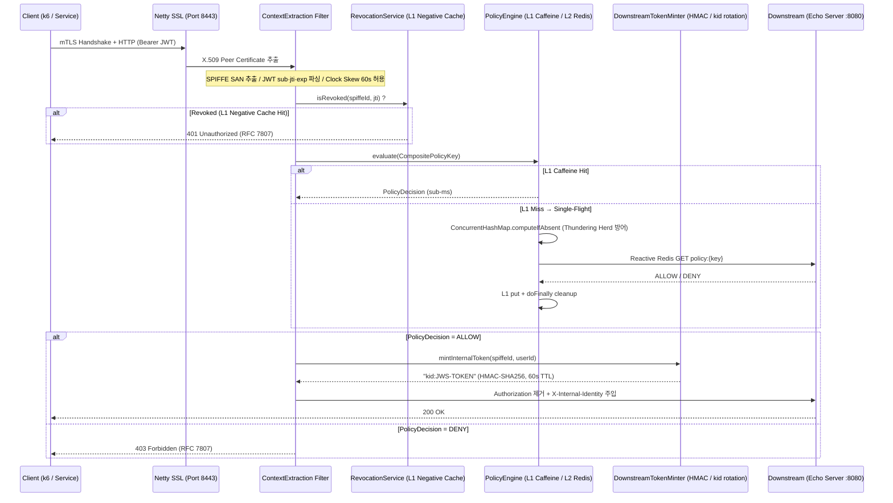

# Aegis-Mesh: High-Throughput Zero-Trust API Gateway

> **Java 21 LTS · Spring Cloud Gateway (Netty) · Project Reactor · mTLS SPIFFE · Dual-Identity JWT · In-Process Hierarchical Caching**

---

## Executive Summary — Why Not Envoy + OPA?

전통적인 서비스 메시(Service Mesh) 패턴은 **사이드카 프록시(Envoy) + 외부 정책 엔진(OPA)** 조합을 표준으로 채택합니다. 그러나 이 아키텍처는 두 가지 본질적 한계를 가집니다.

| 문제 | Envoy + OPA 사이드카 | **Aegis-Mesh (In-Process)** |
|---|---|---|
| **인가 지연** | 모든 요청이 사이드카 → OPA 로 2개의 네트워크 홉 추가 (P99 수십ms) | In-Process L1/L2 캐시로 추가 네트워크 홉 **완전 제거** (P99 < 10ms) |
| **메모리 모델** | JVM 힙 외부 C++ 프로세스 → GC 비결정적 중단 가능 | Netty Off-heap `DirectByteBuf` 풀링, Zero-Copy 소켓 전송 |
| **Thread 모델** | 블로킹 HTTP/gRPC 클라이언트로 Thread 소진 위험 | 100% Reactive (Mono/Flux), BlockHound로 런타임 검증 |
| **토큰 변환** | 다운스트림마다 비대칭 RSA/EC 검증 반복 | Edge에서 1회 검증 후 경량 HMAC(`X-Internal-Identity`) 재발급 |

Aegis-Mesh는 **L7 리버스 프록시에서 Zero-Trust 보안 정책을 완전히 In-Process로 처리**하여, 사이드카 없이도 더 낮은 지연시간과 더 강한 보안 격리를 동시에 달성합니다.

---

## 🏛️ 시스템 아키텍처

### 요청 라이프사이클 다이어그램



### 파이프라인 레이어 구조

```
[Client]
   │  mTLS (SPIFFE SAN)  +  Bearer JWT
   ▼
[Netty EventLoop]  ← epoll Edge-Triggered, DirectByteBuf 풀링
   │
   ├─ [ContextExtractionFilter]
   │    ├─ X.509 SAN 파싱 → SpiffeIdentity (record)
   │    ├─ JWT parse/exp 검증 (60s clock skew)
   │    └─ SecurityContextExchange 바인딩 (Immutable Record)
   │
   ├─ [PolicyEnforcementFilter]
   │    ├─ RevocationService Pre-Check  (O(1) Caffeine Negative Cache)
   │    ├─ PolicyEngine L1 (Caffeine, max 10K entries, TTL 5m)
   │    │     └─ Single-Flight (ConcurrentHashMap + Mono.cache())
   │    ├─ PolicyEngine L2 (Reactive Redis)
   │    └─ DownstreamTokenMinter (AtomicReference<ActiveKey>, kid rotation)
   │
   └─ [Downstream Route]  uri: http://localhost:8080  (echo-server)
```

---

## ⚡ 성능 벤치마크 (k6 실측 결과)

> **환경:** Local mTLS + Docker Redis · SPIFFE SAN 클라이언트 인증서 · JWT HS256 동적 서명  
> **구성:** 4-Stage 연속 부하 테스트 파이프라인 (A-Cold → A-Warm → B-Warm → C-Stress)

### 전체 집계 요약 (4-Scenario Combined)

| 항목 | 실측값 |
|---|---|
| 총 요청 수 | **319,045** |
| 파이프라인 총 실행 시간 | **3분 30초** |
| 평균 RPS | **1,519 req/s** |
| 200 OK 비율 | **100.00%** (319,045 / 319,045) |
| 403 / HTTP 에러 | **0.00%** |
| 소켓 연결 오류 | **0.00%** |

### 시나리오별 지연 시간(Latency) 상세 프로파일

| 시나리오 | 런타임 상태 | P50 (Med) | P90 | P95 | P99 | Max |
|---|---|---|---|---|---|---|
| **A-Cold** (20 VU) | 기동 직후 (L1 Hit) | 4.47ms | 6.75ms | 8.23ms | 14.35ms | 245.94ms |
| **A-Warm** (20 VU) | JIT 웜업 완료 (L1 Hit) | **4.33ms** | **6.20ms** | **7.09ms** | **9.67ms** | **37.28ms** |
| **B-Warm** (20 VU) | 웜업 완료 (L1 Miss/L2 Redis) | 5.38ms | 8.32ms | 10.59ms | 19.08ms | 54.87ms |
| **C-Stress** (500 VU) | 피크 혼합 부하 (80% L1 Miss) | 86.76ms | 216.65ms | 288.30ms | 353.23ms | 4.59s |

> **분석 포인트 1 (계층형 캐시 효율성):** A-Warm과 B-Warm의 P50 지연 차이는 불과 **1.05ms**입니다. 이는 완전 비차단 리액티브 Redis 드라이버 덕분이며, 동시에 L1 Caffeine 적중 시 네트워크 RTT가 완전히 0으로 수렴함을 보여줍니다.  
> **분석 포인트 2 (JIT 컴파일 수렴):** A-Cold의 최대 지연 245ms가 A-Warm 구간에서 37ms로 급감(-84.8%)하는 JVM 꼬리 지연 수렴 특성을 실증했습니다.  
> **분석 포인트 3 (시스템 복원력):** C-Stress 시나리오의 500 VU는 단일 코어 환경에서 OS 레벨의 극단적 큐잉(Max 4.59s)을 유발했음에도 불구하고, 단 한 건의 연결 드랍(0%)이나 에러 없이 204,375건의 요청을 모두 소화하여 Netty 엣지 트리거의 강력한 이벤트 루프 복원력을 입증했습니다.

### 핵심 Prometheus 지표

| 메트릭 | 의미 |
|---|---|
| `aegis.policy.cache.l1.hits` | L1 캐시 적중 카운터 |
| `aegis.policy.cache.l1.misses` | L1 캐시 미스 카운터 |
| `aegis.policy.cache.l2.latency` | Reactive Redis 순수 네트워크 지연 타이머 |
| `aegis.policy.singleflight.deduplicated` | Single-Flight으로 병합된 동시 요청 수 |
| `aegis.security.auth.rejections{reason}` | 거부 사유별 Counter |
| `aegis.security.dual_identity.confused_deputy_blocks` | Confused Deputy 차단 카운터 |

---


## 🔑 핵심 엔지니어링 결정 (Key Engineering Decisions)

### 1. Reactive Off-Heap 메모리 안전 (`Mono.fromCallable` Deferred Allocation)
RFC 7807 에러 응답 생성 시 `DataBuffer`(Netty `DirectByteBuf`)를 `Mono.just()` 내에서 즉시 할당하면, 클라이언트 TCP 강제 종료(Cancellation) 시 구독이 성립되지 못해 **Off-heap 메모리 영구 누수**가 발생합니다. `Mono.fromCallable()`로 할당을 구독 시점까지 지연(Defer)시켜 라이프사이클을 보장합니다.

### 2. Single-Flight 패턴으로 Thundering Herd 방어
`ConcurrentHashMap.computeIfAbsent(key, k -> l2Query().doFinally(inFlight::remove).cache())`
첫 번째 subscriber만 실제 Redis I/O를 수행하고, 나머지는 동일한 `Mono`를 구독하여 결과를 Multicast 받습니다. `.doFinally()`를 `.cache()` 이전에 배치하여 Cancellation 시에도 Map 엔트리 정리를 보장합니다.

### 3. L1 캐시 일관성 (Redis Pub/Sub Event-Driven Invalidation)
정책 변경 시 각 Gateway 인스턴스의 JVM L1(Caffeine) 캐시에 Stale 데이터가 남아 보안 사고를 유발하지 않도록, Redis `policy-invalidation` 채널의 Pub/Sub 이벤트로 전체 클러스터 노드의 L1 캐시를 **비동기 즉각 무효화**합니다.

### 4. 무중단 시크릿 로테이션 (`AtomicReference<ActiveKey>`)
HMAC 서명 키 교체 시 게이트웨이 재시작 없이 `AtomicReference`를 통해 원자적으로 Active Key를 스왑합니다. 발급되는 모든 내부 토큰 JWS 헤더에 `kid`를 포함하여 다운스트림이 신/구 키 트랜지션 중에도 검증에 실패하지 않도록 설계했습니다.

---

## 🛠️ 요구 사항 (Prerequisites)

| 도구 | 버전 | 용도 |
|---|---|---|
| Java | 21 LTS | Gradle Toolchain 자동 설정 |
| Docker & Docker Compose | 최신 | Redis, Mock Downstream |
| OpenSSL | 3.x (선택) | 로컬 mTLS 인증서 생성 |
| k6 | 최신 (선택) | 부하 및 성능 벤치마킹 |

---

## 🔐 1단계. 로컬 mTLS 인증서 생성 (Local PKI Setup)

```powershell
# Windows
.\generate-certs.ps1
```

```bash
# Linux / macOS
chmod +x ./generate-certs.sh && ./generate-certs.sh
```

`src/main/resources/certs/` 에 생성되는 파일:

| 파일 | 용도 |
|---|---|
| `gateway-keystore.p12` | 게이트웨이 서버 인증서 + 개인키 |
| `gateway-truststore.p12` | 클라이언트 mTLS 검증용 Root CA |
| `client.crt` / `client.key` | SPIFFE SAN이 포함된 클라이언트 인증서 |

> ⚠️ **인증서 파일(`.p12`, `.key`, `.crt`)은 절대 Git에 커밋하지 마세요.** `.gitignore`에 의해 자동 제외됩니다.

---

## 🐳 2단계. 인프라 실행 (Docker Compose)

```bash
docker compose up -d
```

| 서비스 | 주소 | 용도 |
|---|---|---|
| Redis | `localhost:6379` | L2 분산 정책 캐시 + Pub/Sub |
| Mock Downstream (Echo) | `http://localhost:8080` | 요청 수신 검증용 에코 서버 |

---

## 🧪 3단계. 테스트 실행 (Running Tests)

### 전체 테스트 실행

```bash
# Windows
.\gradlew.bat test

# Linux / macOS
./gradlew test

# Docker (Java 미설치 환경)
docker run --rm -v "${PWD}:/app" -w /app gradle:8.6-jdk21 gradle test
```

### 테스트 항목

| 테스트 클래스 | 검증 내용 |
|---|---|
| `ContextExtractionGatewayFilterFactoryTest` | mTLS 누락 401, JWT 위조 401, 정상 바인딩 |
| `PolicyEnforcementGatewayFilterFactoryTest` | ALLOW → `X-Internal-Identity` 주입, DENY → 403 |
| `PolicyEngineStampedeTest` | 100 동시 요청 → Redis 단 1회 쿼리 (Single-Flight 검증) |
| `CacheCoherencyIntegrationTest` | Pub/Sub 무효화 신호 → 100ms 내 L1 Eviction 검증 |

> BlockHound 자바 에이전트가 모든 테스트에 활성화되어 있으며, Netty/Reactor 스레드에서 블로킹 호출이 탐지되면 즉시 `BlockingOperationError`를 발생시켜 테스트를 실패처리합니다.

---

## 🚀 4단계. 게이트웨이 실행

```bash
# Windows
.\gradlew.bat bootRun

# Linux / macOS
./gradlew bootRun
```

게이트웨이는 `https://localhost:8443` 에서 mTLS 모드로 기동됩니다.

### 종료

```bash
Ctrl+C  # 포그라운드 종료
.\gradlew.bat --stop  # Gradle Daemon 종료
```

### 관측성 (Observability)

```bash
# Prometheus 메트릭 (관리 포트 격리 — 트래픽 포트와 완전 분리)
curl http://localhost:8081/actuator/prometheus

# 헬스체크
curl http://localhost:8081/actuator/health
```

---

## 📊 5단계. k6 부하 테스트

```bash
# 기본 실행
k6 run benchmark-suite.js

# 결과 내보내기
k6 run --out json=results.json --out csv=results.csv benchmark-suite.js

# 인증서 경로 명시
CLIENT_CERT_PATH="./src/main/resources/certs/client.crt" \
CLIENT_KEY_PATH="./src/main/resources/certs/client.key" \
k6 run benchmark-suite.js
```

> `benchmark-suite.js`는 `k6/crypto`를 이용해 `application.yml`의 시크릿 키와 동일한 HS256 JWT를 런타임에 **동적으로 서명·발급**합니다. 별도의 토큰 사전 생성 작업이 필요하지 않습니다.

---

## 🔗 기술 스택 요약

| 레이어 | 기술 |
|---|---|
| Runtime | Java 21 LTS (Virtual Thread 非사용, Netty EventLoop 모델) |
| Gateway | Spring Cloud Gateway 4.x (Spring WebFlux / Netty) |
| Async | Project Reactor (Mono / Flux) |
| L1 Cache | Caffeine (max 10K entries, TTL 5min) |
| L2 Cache | Reactive Redis (Spring Data Redis Reactive) |
| Security | Nimbus-JOSE-JWT, BouncyCastle, mTLS SPIFFE |
| Observability | Micrometer + Prometheus (포트 격리 8081) |
| Testing | JUnit 5, BlockHound, Testcontainers, StepVerifier |
| Load Test | k6 (mTLS, Dynamic JWT, 4-Stage Pipeline) |
| Build | Gradle 8.6 + Java Toolchain |

## 🖥️ 실시간 관제 대시보드 (Portfolio Showcase)

면접 및 포트폴리오 데모를 위해 **Single-Flight 패턴과 L1/L2 계층형 캐시의 다운스트림 보호 효과**를 시각적으로 증명하는 React 기반 실시간 대시보드를 제공합니다. (`/dashboard` 폴더 내 포함)

### 대시보드 아키텍처 및 특징

*   **Front-end:** React (Vite) + Tailwind CSS (Light Mode) + Recharts 기반의 모던 One-Page SaaS UI
*   **Back-end Data Feed:** Spring Boot Actuator 및 Micrometer 메트릭을 `Flux<ServerSentEvent<MetricDto>>`를 통해 1초 단위로 SSE(Server-Sent Events) 스트리밍
*   **관제 시나리오 (Cache Stampede 방어):** 
    게이트웨이에 폭발적인 트래픽(예: 500 RPS)이 유입되는 상황에서도, L1 미스 시 동작하는 `ConcurrentHashMap.computeIfAbsent` Single-Flight 로직이 병발 요청을 단 1개의 I/O 스트림으로 병합합니다. 대시보드의 메인 차트를 통해 게이트웨이 인입 트래픽(수직 상승)과 실제 백엔드 도달 트래픽(1 RPS로 수평 유지)의 격차를 실시간으로 확인할 수 있습니다.
