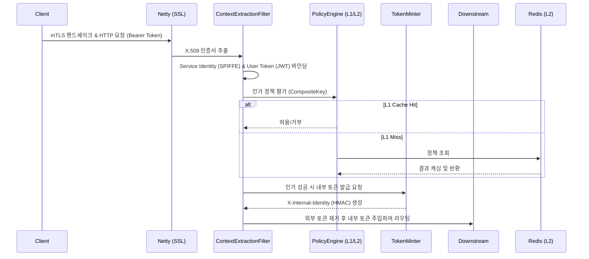

# High-Throughput Zero-Trust API Gateway 아키텍처 및 개념 가이드
## 1. 시스템 아키텍처 및 데이터 플로우
본 시스템은 In-Process 정책 엔진과 이중 신원 바인딩(Dual-Identity Binding)을 통해 네트워크 홉을 제거하고 보안성을 강화한 Zero-Trust API Gateway입니다.
### 1.1. 파이프라인 다이어그램

### 1.2. 라이프사이클 요약
1. **Connection & TLS:** Netty 서버에서 mTLS 핸드셰이크를 처리.
2. **Context Extraction:** 파이프라인에서 X.509 Client 인증서의 SAN(SPIFFE ID)과 HTTP 헤더의 User Token(JWT/DPoP)을 추출.
3. **Security Binding:** 두 신원을 `SecurityContextExchange` 객체로 결합하여 하나의 트랜잭션 컨텍스트 형성.
4. **Fast-Fail Check:** 메서드, 경로, 형식 등 기본 검증 수행.
5. **Policy Enforcement:** L1(Caffeine) -> L2(Reactive Redis) 순서로 ABAC/RBAC 정책 평가.
6. **Token Translation:** 외부 신원 증명을 제거하고, 내부 검증용 경량 HMAC 서명 헤더(`X-Internal-Identity`) 발급.
7. **Downstream Dispatch:** 다운스트림 마이크로서비스로 요청 전달.
## 2. 핵심 CS 원리 및 트레이드오프
### 2.1. Netty EventLoop 스레드 모델과 Blocking I/O의 치명적 위험성
*   **원리:** Netty는 코어 수에 비례하는 소수의 EventLoop 스레드가 다수의 네트워크 커넥션을 멀티플렉싱(NIO)하여 처리하는 구조입니다. 즉, 스레드 하나가 수천 개의 동시 연결을 책임집니다.
*   **위험성 (Anti-Pattern):** Reactive 필터 체인(Spring WebFlux/Gateway) 내에서 RDBMS 조회, 동기 API 호출, 혹은 무거운 해시 연산(`BCrypt` 등)과 같은 Blocking 작업이 발생하면, 해당 EventLoop 스레드가 일시 정지(Wait)됩니다. 이로 인해 스레드가 담당하던 수천 개의 다른 클라이언트 요청까지 모두 멈추게 되어 전체 시스템의 처리량(Throughput)이 급감하는 치명적 장애로 이어집니다.
*   **해결 및 검증:** Redis 연동 및 모든 필터 로직은 `Reactor`의 `Mono`/`Flux`를 이용한 100% Non-blocking 방식으로 구현되었습니다. 추가로 `BlockHound` 자바 에이전트를 도입하여 테스트 단계에서 숨겨진 블로킹 호출(예: `Thread.sleep()`, 동기 파일 I/O)을 런타임에 감지하고 차단하도록 강제했습니다.
### 2.2. 캐시 일관성 (L1 JVM Heap vs. L2 Redis) 및 Single-Flight (Thundering Herd 완화)
*   **2-Tier 구조의 당위성:** 매 요청마다 외부 OPA(Open Policy Agent)나 인가 서버를 호출하면 네트워크 홉(Hop) 지연이 발생합니다. 이를 없애기 위해 API Gateway 프로세스 내부(JVM Heap)에 L1(Caffeine) 캐시를, 클러스터 공유 및 영속성 보장을 위해 L2(Reactive Redis)를 배치했습니다.
*   **일관성(Coherency) 문제:** 관리자가 권한을 회수했을 때, 각 Gateway 인스턴스의 L1 캐시에 남은 Stale Data(과거 데이터)로 인해 보안 사고가 발생할 수 있습니다.
*   **Pub/Sub 기반 무효화:** 이를 극복하기 위해 Redis Pub/Sub(`policy-invalidation` 채널)을 활용, 인가 정책 변경 시 모든 클러스터 노드의 L1 캐시를 즉각적으로 무효화(Evict)하는 Event-driven 아키텍처를 적용했습니다.
*   **Cache Stampede (Thundering Herd) 방어:** 특정 인기 API의 캐시가 만료되는 순간, 수천 개의 동시 요청이 일제히 L2 캐시나 DB로 몰려가는 현상이 발생할 수 있습니다. 이를 방어하기 위해 `ConcurrentHashMap`과 Reactor의 `.cache()` 연산자를 결합한 **Single-Flight 패턴**을 구현했습니다. 동일한 키에 대한 요청들은 큐잉(Coalescing)되어 단 하나의 네트워크 I/O만 발생하며, 결과를 모든 대기자에게 멀티캐스트합니다.
### 2.3. Native Memory(Off-heap) 관리와 버퍼 누수 방지
*   **원리:** Netty는 GC(Garbage Collection) 부하를 줄이고 소켓 I/O 성능을 극대화하기 위해 JVM 힙이 아닌 OS 네이티브 메모리를 직접 다루는 `DirectByteBuf`를 사용합니다.
*   **위험성:** 리액티브 스트림에서 에러 응답(RFC 7807) 등을 위해 `ByteBuf`를 할당했으나 클라이언트가 갑자기 연결을 끊어버리면(Cancellation), 구독(Subscription) 체인이 성립되지 못하면서 할당된 네이티브 메모리가 영영 반환되지 않는 누수(Memory Leak)가 발생합니다.
*   **해결:** 메모리 할당 타이밍을 엄격히 통제해야 합니다. 데이터를 버퍼로 래핑하는 작업을 `Mono.just()`가 아닌 `Mono.fromCallable()` 내부로 지연(Defer)시켜, 실제 퍼블리셔가 확실히 구독되고 라이프사이클(성공 또는 에러 후 `DataBufferUtils.release`)이 보장되는 시점에만 Off-heap 메모리가 점유되도록 설계했습니다.
### 2.4. 비대칭 암호화 핸드셰이크 비용 vs. 대칭 HMAC 검증
*   **트레이드오프:** Edge(Gateway)에서는 비대칭 키(RSA/ECC) 기반의 mTLS 및 JWT 서명 검증을 수행합니다. 이는 외부 인터넷 구간에서의 높은 신뢰성을 보장하지만 CPU 연산 비용(수천 사이클)이 매우 큽니다.
*   **최적화 (Token Translation):** 내부 프라이빗 네트워크인 다운스트림 통신에서는 이미 Gateway가 물리적/논리적 신뢰를 보증했으므로 무거운 비대칭 검증을 반복할 필요가 없습니다. Gateway가 통과된 요청에 대해 고속 대칭키 알고리즘(HMAC-SHA256)으로 가벼운 내부 토큰(`X-Internal-Identity`)을 재발급하여 전달합니다. 이를 통해 마이크로서비스들의 인증 관련 CPU 오버헤드를 대폭 감소시켰습니다.

## 3. 프로덕션 등급 보안 및 관측성 (Production-Grade Security & Observability)
### 3.1. 무중단 시크릿 로테이션 (Zero-Downtime Secret Rotation)
*   **문제:** 내부 통신용 HMAC 토큰 서명 키가 탈취되거나 정기 교체 시기가 도래했을 때, 게이트웨이 재시작 없이 키를 갱신해야 함.
*   **해결:** `AtomicReference` 기반의 활성 키(ActiveKey) 래핑을 통해 동시성 문제를 해결하고, 발급되는 JWS 헤더에 키 버전(`kid`)을 명시하여 다운스트림이 검증 시 충돌 없이 신/구 키를 트랜지션할 수 있도록 아키텍처링.
### 3.2. 분산 토큰 무효화 및 L1 Negative-Cache (Real-Time Revocation)
*   **문제:** JWT의 특성상 만료 전까지는 탈취된 토큰을 즉시 막기 어려움 (Stateless 한계).
*   **해결:** Redis Pub/Sub(`token:revocation`)을 통해 즉각적인 토큰 무효화(JTI/SPIFFE ID) 브로드캐스트를 수신. 이를 Caffeine L1 Negative Cache에 짧은 지연(O(1) 검색 시간)으로 기록하여, 복잡한 정책 엔진(ABAC/RBAC)을 가동하기 전 최우선 차단(Pre-Check).
### 3.3. Micrometer 기반 리액티브 텔레메트리 (Reactive Telemetry)
*   **문제:** 논블로킹 시스템에서는 스레드 덤프나 전통적인 프로파일러로 특정 구간의 병목이나 캐시 효율성을 추적하기 어려움.
*   **해결:** Micrometer를 도입하여 리액티브 스트림의 생명주기(`Mono.fromCallable`, `doOnSubscribe` ~ `doFinally`)와 통합. L1 Hit/Miss 효율, L2 Redis 접근의 정밀 지연시간(Latency Timer), Single-flight 병합 수치(Deduplication)를 실시간 메트릭으로 추출하여 Prometheus 관측 체계 구축.

## 4. 고급 딥다이브 주제
### 4.1. Confused Deputy 공격 방어 및 이중 신원 위임(Dual-Identity Binding)
*   **문제 정의 (Confused Deputy):** 공격자가 직접 권한이 없는 타겟 시스템(B)에 접근하기 위해, 권한이 있는 대리자 시스템(A)을 교묘하게 조종하여 대신 요청을 보내게 만드는 권한 상승 공격입니다. 예를 들어, 사용자가 '이미지 변환 서비스(A)'를 호출하면서 악의적인 내부 S3 URL을 전달해 '프라이빗 스토리지(B)'의 데이터를 빼돌리는 경우가 이에 해당합니다.
*   **방어 전략:** Gateway는 단순히 User Token(사용자 권한)이나 Service Identity(mTLS - 서비스 A의 권한) 중 하나만 확인하지 않습니다. 두 신원을 추출해 `SecurityContextExchange`라는 하나의 객체로 **암호학적으로 바인딩(Binding)**합니다. 즉, 정책 엔진은 "서비스 A가 사용자 X의 위임을 받아 서비스 B에 접근하는 행위" 자체를 하나의 Composite Key로 묶어서 평가하므로, 권한 오남용을 원천 차단합니다.
### 4.2. Epoll 멀티플렉싱과 Netty Zero-Copy의 심층 이해
*   **Edge-Triggered Epoll:** 기존의 `select`나 `poll`은 모든 파일 디스크립터(FD)를 순회하며 상태 변화를 확인(O(N))하므로 연결이 많아질수록 성능이 급락합니다. Aegis-Mesh는 리눅스 환경에서 Netty Native Transport를 활용하여 `epoll` 엣지 트리거(Edge-Triggered) 방식을 사용합니다. 이는 상태가 변한 FD만 OS 커널로부터 통보받아 처리(O(1))하므로, C10K 이상의 초고도 동시성 환경에서도 CPU 점유율이 일정하게 유지됩니다.
*   **Zero-Copy (`ByteBufAllocator`):** 전통적인 I/O는 네트워크 카드로 데이터를 보내기 위해 OS 커널 버퍼에서 JVM Heap으로 데이터를 복사(Copy)하는 과정을 거칩니다. Netty의 `DirectByteBuf`는 OS 메모리를 직접 참조(Zero-Copy)하여 불필요한 CPU 복사 연산과 가비지 컬렉션(GC) 부하를 극적으로 줄입니다.
### 4.3. Zero-Trust Network Architecture (NIST SP 800-207) 완벽 정렬
*   **Verify Explicitly (명시적 검증):** "내부망에 있으니 안전하다"는 성곽형(Perimeter) 보안 모델을 폐기합니다. 위치나 네트워크 대역에 관계없이 모든 단일 접근 요청은 매번 mTLS 인증서(기기/서비스 인증)와 JWT(사용자 인증)를 통해 명시적으로 검증됩니다.
*   **Least Privilege (최소 권한 원칙):** 거대한 통합 권한이 아닌, In-Process L1/L2 정책 엔진을 통해 마이크로 단위의 세분화된(Fine-grained) 접근 제어(ABAC/RBAC)를 강제합니다.
*   **Assume Breach (침해 가정):** 시스템 내부의 일부가 이미 해킹되었다고 가정합니다. Gateway가 강력한 정책 확인을 거친 후 발급하는 '다운스트림 내부 서명 토큰(HMAC)' 없이는 마이크로서비스 간의 횡적 이동(Lateral Movement)이 불가능하도록 아키텍처 수준의 암호학적 격리를 이뤄냈습니다.

## 5. Java 21 런타임 아키텍처 및 CS 트레이드오프
### 5.1. Java 21 Virtual Threads (Project Loom) vs. Netty EventLoop
*   **Virtual Threads의 장점:** I/O 작업(JDBC, 전통적 서블릿) 시 JVM 레벨에서 Continuation을 통해 블로킹을 해제하므로, Thread-per-request 모델에서 매우 높은 확장성을 제공함.
*   **Netty가 L7 Gateway에 여전히 적합한 이유:** API Gateway는 단순 I/O 블로킹 해제뿐만 아니라 막대한 양의 네트워크 패킷 파싱, 헤더 조작, SSL 복호화가 필요함. Netty의 `ByteBuf` 다이렉트 메모리 풀링(Zero-copy), OS Native Epoll 멀티플렉싱 기술은 L7 프록시 계층에서 서브 밀리초(sub-millisecond) 지연을 달성하는 데 필수적임.
*   **Carrier Thread Pinning 리스크 회피:** 초기 Virtual Threads는 `synchronized` 블록이나 JNI 호출 시 기저의 OS 캐리어 스레드를 점유(Pinning)해버리는 한계가 있음. Spring Cloud Gateway와 Netty 기반의 순수 리액티브 모델은 이러한 Pinning 리스크 없이 고부하 상황에서도 안정적인 지연 시간을 보장함.
### 5.2. 메모리 불변성(Immutability)과 Java 21 Records
*   **스레드 안전성과 Safe Publication:** 인가 정책 키(`CompositePolicyKey`)나 신원 컨텍스트를 불변 객체인 `record`로 선언함으로써, 멀티 스레드 리액티브 파이프라인에서 락(Lock)이나 동기화 구문 없이도 Memory Visibility(가시성) 문제와 Race Condition을 원천 차단함.
*   **캐시 친화성(Cache-friendliness):** `record`는 불필요한 객체 할당 오버헤드를 감소시키고 JVM Heap 내부 CPU L1/L2 데이터 캐시 지역성(Locality)을 향상시켜, 수십만 건의 Caffeine L1 캐시 동시 검색 속도를 극대화함.
### 5.3. Pattern Matching과 Type-Safe Fast-Fail 파이프라인
*   **컴파일러 수준의 안전성:** Java 21의 `switch` Pattern Matching을 도입하여 다양한 Principal 분기(SPIFFE, User Token, Anonymous 등)를 컴파일 타임에 완전(Exhaustive)하게 검증함.
*   **NPE 및 캐스팅 예방:** 런타임 `instanceof` 다운캐스팅 시 발생할 수 있는 ClassCastException이나 Null Pointer Exception 위험을 완전히 제거하고, 식별 불가능한 신원이 파이프라인에 유입될 시 즉시 차단(Fast-Fail)하도록 강제함.

## 6. 면접 대비 기술 요약 (Interview Talking Points)
*   **Q: 왜 Java 21의 Virtual Threads만 쓰지 않고 Netty 기반의 Reactive 모델을 고집했는가?**
    *   **A:** Virtual Threads는 I/O 블로킹 병목을 해소하는 데는 탁월하지만, 초고성능 API Gateway는 네트워크 패킷의 메모리 복사를 최소화하는 Zero-copy 기술과 네이티브 다이렉트 버퍼 관리 능력이 훨씬 더 중요합니다. Epoll 멀티플렉싱과 `ByteBuf` 풀링에 극도로 최적화된 Netty EventLoop가 대규모 L7 리버스 프록시 역할에는 아키텍처상 압도적으로 유리하기 때문입니다.
*   **Q: Record와 Pattern Matching을 도입하여 얻은 구체적인 아키텍처적 이점은 무엇인가?**
    *   **A:** 보안 컨텍스트를 완전한 불변 객체(`record`)로 만들어, 수많은 리액티브 스레드가 교차하는 환경에서도 락(Lock) 없이 완벽한 가시성(Memory Visibility)과 Safe Publication을 달성했습니다. 또한, 분기 처리에 `switch` 패턴 매칭을 활용하여 런타임 캐스팅 에러나 분기 누락의 위험을 컴파일 타임에 원천 차단했습니다.
*   **Q: 비동기 논블로킹(Reactive) 시스템에서 발생하기 쉬운 메모리 릭(Memory Leak)을 어떻게 예방했는가?**
    *   **A:** 클라이언트가 요청을 도중에 취소(Cancellation)할 경우 스트림 구독이 끊어지면서 Netty의 네이티브 Off-heap 버퍼가 반환되지 않는 문제가 생길 수 있습니다. 이를 방지하기 위해 버퍼 할당 시점을 `Mono.fromCallable()`로 엄격하게 지연(Defer)시켰고, 라이프사이클을 안전하게 통제했습니다. 더불어 `BlockHound` 자바 에이전트를 테스트에 연동해 숨겨진 블로킹/누수 코드를 완벽히 색출했습니다.
*   **Q: 캐시 스탬피드(Cache Stampede / Thundering Herd) 현상을 무중단 환경에서 어떻게 방어했는가?**
    *   **A:** 특정 인가 정책의 L1 캐시가 만료된 순간 초당 수천 개의 동일 요청이 들어오면 L2 Redis나 DB가 마비될 수 있습니다. 이를 `ConcurrentHashMap`의 `computeIfAbsent` 원자적(Atomic) 연산과 Reactor의 `.cache()` 연산자를 결합한 'Single-Flight' 패턴으로 방어했습니다. 첫 요청만 네트워크 I/O를 수행하고, 나머지 요청은 대기(Coalescing) 상태로 전환되어 첫 번째 결과를 동일하게 공유(Multicast) 받도록 설계했습니다.
*   **Q: JWT 토큰의 태생적 한계인 무효화(Revocation) 처리를 분산 환경에서 어떻게 실시간으로 해결했는가?**
    *   **A:** JWT는 Stateless 특성상 만료 전까지는 자체 차단이 어렵습니다. 이를 해결하기 위해 Redis Pub/Sub 기반의 브로드캐스트 아키텍처를 구현했습니다. 특정 토큰(JTI)이나 인증서(SPIFFE)가 침해되면 이벤트가 발행되고, 각 게이트웨이 인스턴스의 Caffeine L1 Negative Cache에 즉시 등록됩니다. 이후 모든 요청은 복잡한 인가 정책을 타기 전에 O(1) 시간 복잡도로 필터링(Pre-Check)되어 무효화 반영 지연 시간을 서브 밀리초 수준으로 단축했습니다.