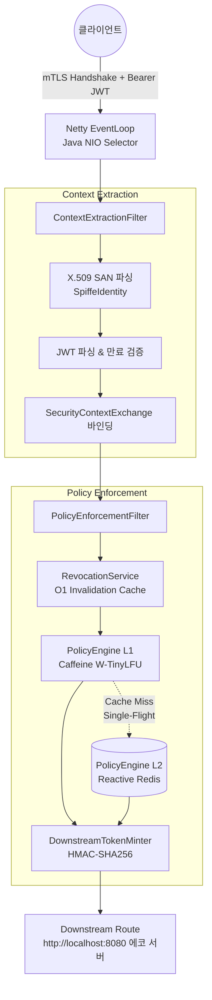
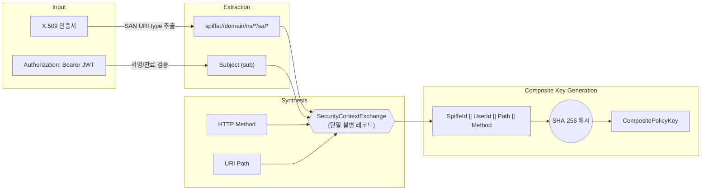
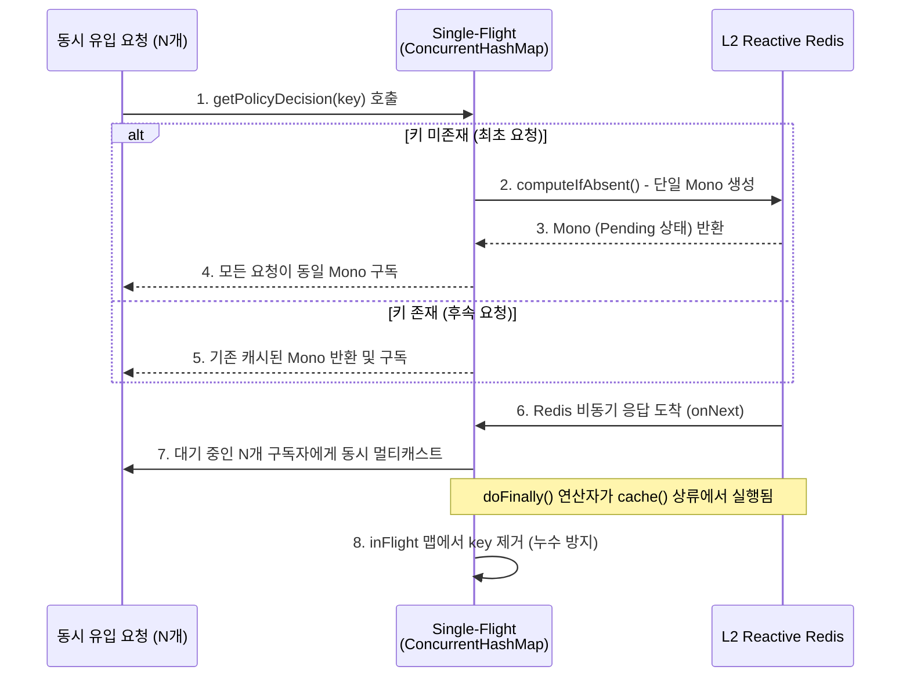

# 비차단 계층형 캐싱과 단일 비행(Single-Flight) 패턴을 적용한 고성능 제로 트러스트 API 게이트웨이 설계 및 성능 평가

---

## 국문 요약

본 논문은 제로 트러스트 API 게이트웨이 aegis-mesh를 제안한다. 이 시스템은 외부 인가 서버를 거치지 않고 게이트웨이 프로세스 내부에서 인가 정책 평가를 완료한다.

제안 시스템은 세 가지 핵심 설계를 포함한다.

1. 이중 신원 합성 메커니즘을 적용했다. mTLS SPIFFE 서비스 신원과 사용자 JWT를 단일 불변 객체(SecurityContextExchange)로 암호학적으로 결합한다.

2. 2계층 캐시 구조를 도입했다. JVM 인메모리(L1)와 리액티브 Redis(L2)를 결합하여 외부 인가 서버로 향하는 네트워크 홉을 제거한다.

3. 단일 비행(Single-Flight) 패턴을 구현했다. L1 캐시 만료 시 발생하는 동시 폭주 요청을 단일 Redis I/O로 병합하여 시스템 포화를 차단한다.

k6 기반 부하 테스트를 통해 계층형 캐시의 지연 억제 효과를 확인하였다. 웜업 완료 후 L1 캐시 적중 시 응답 지연은 P50 5.55 ± 0.61 ms, P99 20.89 ± 5.00 ms, 최대 41.02 ~ 77.35 ms를 기록하였다. 전량 L1 캐시 미스 상황(P50 7.02 ± 1.43 ms, P99 26.89 ± 9.35 ms, 최대 53.35 ~ 108.05 ms)과 비교할 때 꼬리 지연(Tail Latency)이 단축되었음을 나타낸다.

JVM 초기 기동(Cold Start) 구간의 성능도 평가하였다. 초기 기동 구간에서도 P50 기준 7.07 ± 1.94 ms의 응답 지연을 나타낸다. JIT 컴파일러 웜업이 진행됨에 따라 최대 지연 시간은 442.96 ~ 753.05 ms에서 41.02 ~ 77.35 ms로 약 89.7% 감소하였으며, 이는 지연 시간이 점차 수렴하는 경향을 나타낸다.

극단적인 동시 부하 환경에서의 구조적 안정성도 확인하였다. 500명의 가상 사용자를 투입한 시나리오에서 총 155,546 ± 17,927건의 요청을 단 1건의 오류 없이 처리하여 100%의 가용성을 확인하였다.

**핵심어:** 제로 트러스트, API 게이트웨이, mTLS, SPIFFE, 리액티브 시스템, 캐시 스탬피드, 단일 비행 패턴, Spring Cloud Gateway

---

## Abstract

This paper presents the design and implementation of `aegis-mesh`, an in-process Zero-Trust API gateway that evaluates authorization policies entirely within the gateway process. The proposed system incorporates three core designs: (1) a dual-identity synthesis mechanism that cryptographically binds an mTLS SPIFFE service identity with a user JWT into a single immutable `SecurityContextExchange` record; (2) a two-tier cache combining in-memory Caffeine (L1) with reactive Redis (L2) to eliminate network hops to external authorization servers; and (3) a Single-Flight pattern that coalesces concurrent stampeding requests upon L1 cache expiry into a single Redis I/O operation. Through a unified ablation benchmark using k6 under warmed-up runtime conditions, the L1 cache hit path (Scenario A-Warmed) achieved a median (P50) latency of 5.55 ± 0.61 ms, P90 of 10.91 ± 2.14 ms, P95 of 13.75 ± 2.86 ms, P99 of 20.89 ± 5.00 ms, and a maximum latency range of 41.02 ~ 77.35 ms, indicating consistent latency reductions relative to the forced L1-cache-miss path (Scenario B-Warmed: P50 of 7.02 ± 1.43 ms, P90 of 14.13 ± 5.05 ms, P95 of 17.45 ± 5.86 ms, P99 of 26.89 ± 9.35 ms, and Max range of 53.35 ~ 108.05 ms). Furthermore, the evaluation shows that although the initial cold start yields a median latency of 7.07 ± 1.94 ms, JVM JIT warm-up substantially reduces tail latency, reducing the maximum latency by 89.7% (from 442.96 ~ 753.05 ms down to 41.02 ~ 77.35 ms). Finally, the gateway exhibited zero connection failures across 155,546 ± 17,927 requests under a 500-virtual-user stress test, indicating structural resilience under extreme concurrency (Scenario C).

**Keywords:** Zero Trust, API Gateway, mTLS, SPIFFE, Reactive Systems, Cache Stampede, Single-Flight Pattern, Spring Cloud Gateway

---

## I. 서론

### 1.1 연구 배경 및 문제 제기

전통적인 네트워크 경계 기반 보안 모델은 마이크로서비스 환경에서 한계를 나타낸다. 클러스터 내부망에 대한 암묵적 신뢰(Implicit Trust)는 더 이상 유효한 전제로 간주되지 않는다. 이러한 배경에서 NIST SP 800-207 [1]은 제로 트러스트 아키텍처(ZTA)를 표준화하였다. ZTA는 네트워크 위치와 무관하게 모든 접근 요청을 명시적으로 검증한다. 이를 구현하기 위해 현대 클라우드 네이티브 인프라는 상호 TLS(mTLS) 기반의 서비스 신원 인증과 세분화된 접근 제어(ABAC/RBAC)를 필수적으로 요구한다.

하지만 엄격한 보안 검증은 지연 시간 증가라는 직접적인 트레이드오프를 발생시킨다. 특히 꼬리 지연(Tail Latency)은 시스템의 서비스 수준 목표(SLO) 위반을 초래하는 핵심 요인이다. 이러한 지연 문제는 기존 인프라가 채택한 구조적 한계에서 기인한다.

### 1.2 기존 접근법의 한계

서비스 메시(Service Mesh) 분야의 일반적인 설계는 **사이드카 기반 분리 모델**이다. Istio/Envoy 조합 [2]은 각 마이크로서비스 인스턴스 인접 위치에 Envoy 프록시 컨테이너를 배치하고, 외부 정책 엔진인 Open Policy Agent(OPA)를 인가 결정 서버로 연동한다.

이 구조에는 두 가지 본질적인 오버헤드가 수반된다.

**첫째, 네트워크 홉 증가이다.** 애플리케이션 컨테이너 $\rightarrow$ 사이드카 프록시 $\rightarrow$ OPA 서버의 경로로 최소 2개의 추가 네트워크 홉이 발생한다. 각 홉은 호스트 네트워크 또는 가상 네트워크 브리지를 통과하는 IPC 비용을 포함한다. Zhu et al. [3]은 서비스 메시 구성과 부하 조건에 따라 상당한 추가 지연과 가상 CPU 사용량 증가가 관측될 수 있음을 보고하였다. 트래픽 피크 시 이 오버헤드는 꼬리 지연을 가중시키는 요인으로 작용한다.

**둘째, 직렬화 오버헤드이다.** 인가 정책 평가를 위해 요청 컨텍스트를 JSON 등의 포맷으로 직렬화하여 외부 정책 엔진에 전달하고, 결과를 다시 역직렬화한다. 이 변환 작업은 요청당 CPU 사이클을 소모하여 시스템의 처리량 한계를 낮춘다.

또한 Envoy 사이드카는 JVM 힙 외부의 C++ 프로세스로 동작하므로, 자바 기반 마이크로서비스 게이트웨이와의 런타임 모델 차이가 발생한다. 비동기 논블로킹 파이프라인에서 사이드카 또는 외부 인가 서버로의 부가적 RPC 호출이 발생할 경우, 이벤트 루프의 블로킹 위험이 가중될 수 있다.

표 1은 기존 사이드카 모델과 본 연구에서 제안하는 인프로세스 통합 모델의 주요 아키텍처 특성을 대조한 결과이다.

**표 1.** 기존 사이드카 기반 분리 모델과 제안된 인프로세스 모델의 아키텍처 특성 비교

| 비교 항목 | 기존 사이드카 모델 (Envoy + OPA) | 제안 인프로세스 모델 (`aegis-mesh`) |
| :--- | :--- | :--- |
| **네트워크 홉 (Hop)** | 애플리케이션 $\leftrightarrow$ 프록시 $\leftrightarrow$ 인가 서버 (추가 2-Hop) | 게이트웨이 내부 통합 (추가 Hop 없음) |
| **메시지 직렬화/역직렬화** | JSON 등 외부 전송용 직렬화 필수 | JVM 내부 객체(불변 레코드) 참조로 직렬화 생략 |
| **상태(State) 캐싱** | OPA 자체 캐시 또는 프록시 레벨 분리 캐시 | L1(Caffeine) + L2(Redis) 통합 계층형 캐시 |
| **동시성 제어** | 분산 아키텍처로 인한 캐시 스탬피드 방어 난해 | 단일 비행(Single-Flight) 패턴 적용으로 병발 요청 병합 |
| **프로세스 통신 비용** | 루프백(Loopback) 네트워크 IPC 오버헤드 발생 | 오버헤드 없는 힙 메모리 객체 지향 메서드 호출 |
| **스레드 모델** | 이종(C++ Envoy, Go OPA) 프로세스 간 비동기 결합 | Netty 이벤트 루프 내 통합 리액티브 파이프라인 |

### 1.3 연구 기여

본 논문은 상기 한계를 완화하기 위해 인가 정책 평가 전 과정을 게이트웨이 프로세스 내부에서 완결하는 `aegis-mesh`를 설계하고 성능을 평가한다. 본 연구의 주요 기여는 다음 세 가지이다.

1. **인프로세스 이중 신원 합성:** mTLS SPIFFE ID와 사용자 JWT를 단일 불변 레코드로 암호학적으로 바인딩함으로써, Confused Deputy 공격을 아키텍처 수준에서 차단하는 메커니즘을 제안한다.
2. **계층형 캐시 메커니즘의 소거 검증 및 런타임 수렴 특성 규명:** 외부 사이드카와의 이종 환경 절대 비교 대신, 동일 파이프라인 내에서 L1 캐시 적중 경로, 강제 L1 미스 및 L2 Redis 경로, 고동시성 부하 경로를 단독 실행(Ablation Study)으로 격리 측정한다. 통제된 웜업 환경에서 계층형 캐시의 지연 단축 효과를 확인한다. 또한 초기 기동(Cold Start) 구간에서 발생하는 꼬리 지연 증가 현상이 웜업 과정을 통해 안정화되는 수렴 특성을 정량적으로 분석한다.
3. **단일 비행 패턴의 리액티브 구현 및 안정성 규명:** `ConcurrentHashMap`과 Reactor의 `.cache()` 연산자를 결합하여 캐시 스탬피드를 방어하는 구조를 구현한다. 또한 `.doFinally()` 연산자 배치 순서에 따라 리액티브 메모리 누수가 방지되는 조건을 분석한다.

---

## II. 배경지식 및 관련 연구

### 2.1 서비스 메시 사이드카 모델과 외부 인가 엔진

Syed et al. [4]은 제로 트러스트 아키텍처 관련 조사 연구에서, 서비스 메시가 사이드카 프록시를 통해 mTLS, 관측성, 트래픽 제어를 비즈니스 로직과 분리함으로써 관심사 분리 측면의 이점을 제공한다고 보고하였다. Istio [2]는 데이터 플레인으로 Envoy 프록시를 각 파드(Pod)의 사이드카로 주입하고 컨트롤 플레인에서 정책을 배포한다. Envoy의 외부 인가(ext_authz) 필터는 접근 제어 결정을 별도 인가 서버에 위임하는 방식으로 동작한다.

그러나 Zhu et al. [3]은 프리프린트 연구를 통해 사이드카 프록시 내부 처리, iptables 순회, 소켓 핸드오프, 리소스 경합 등이 복합적으로 작용하여 꼬리 지연을 유발할 수 있음을 보고하였다. 고트래픽 환경에서는 이러한 계층별 오버헤드가 누적되어 지연 증가의 원인이 될 수 있다. Maruf et al. [5] 역시 마이크로서비스 원격 측정 데이터를 분석하여, 서비스 메시 프록시 계층이 서비스 간 통신 오버헤드에 측정 가능한 영향을 미친다는 점을 확인하였다.

### 2.2 SPIFFE/SPIRE와 워크로드 신원

SPIFFE(Secure Production Identity Framework for Everyone) [6]는 이기종 클라우드 환경에서 분산 워크로드 신원을 상호 운용 가능하도록 표준화한 CNCF 명세이다. SPIFFE ID는 `spiffe://<trust-domain>/ns/<namespace>/sa/<service-account>` 형식의 URI 스키마를 따르며, X.509 인증서의 SAN(Subject Alternative Name) 필드에 RFC 5280 [7]이 정의하는 URI 타입으로 인코딩된다.

`aegis-mesh`는 별도의 데몬 의존성 없이도 X.509 SPIFFE SAN 인증서를 Netty SSL 엔진 단계에서 직접 파싱하여 서비스 신원을 추출하도록 설계되었다. 이를 통해 SPIFFE 표준 명세를 준수하면서도 인프로세스 신원 파이프라인을 경량화할 수 있다.

### 2.3 리액티브 스트림과 이벤트 루프 모델

Welsh et al. [8]이 제안한 SEDA(Staged Event-Driven Architecture)는 동시성 서비스를 큐로 결합된 스테이지 파이프라인으로 분해하는 기초 원리를 정립하였다. 이 개념은 비동기 논블로킹 런타임의 이론적 토대가 되었다. 이후 표준화된 Reactive Streams 명세 [9]는 비동기 논블로킹 데이터 처리 시 생산자와 소비자 간의 속도 차이를 제어하는 배압(Backpressure) 인터페이스를 정의한다. Project Reactor는 이를 JVM 상에서 구현한 대표적 라이브러리이다.

이러한 비동기 I/O 패러다임은 운영체제의 `epoll` 엣지 트리거(Edge-Triggered) 메커니즘을 활용하는 Netty 프레임워크를 통해 구현된다. Netty는 적은 수의 이벤트 루프 스레드로 대규모 동시 소켓 연결을 효율적으로 멀티플렉싱한다. 그러나 이벤트 루프 내에서 하나의 블로킹 I/O나 장기 CPU 연산이 발생하면, 해당 스레드에 할당된 모든 채널의 처리가 중단된다. 따라서 리액티브 파이프라인 전반에서 동기식 블로킹 호출은 배제되어야 한다.

---

## III. 시스템 아키텍처 및 설계
### 3.1 전체 파이프라인 구조

`aegis-mesh`는 Spring Cloud Gateway 및 Netty 이벤트 루프 기반으로 구축되었다. 클라이언트의 인바운드 요청은 일련의 논블로킹 필터를 순차적으로 통과한다. 그림 1은 시스템의 전체 요청 처리 파이프라인과 필터 체인 구조를 나타낸다.

> **그림 1.** aegis-mesh 리액티브 요청 처리 파이프라인 구조

### 3.2 mTLS SPIFFE ID 파싱 및 이중 신원 합성

#### 3.2.1 SPIFFE SAN 추출

`ContextExtractionGatewayFilterFactory`는 Netty SSL 핸드셰이크 완료 시점에 피어 X.509 인증서를 추출한다. mTLS 핸드셰이크는 RFC 8446 [10] TLS 1.3 규격에 따라 피어 인증서 교환 및 서명 검증을 수행한다. 필터는 인증서의 SAN 목록에서 URI 타입(코드 6) 항목을 순회하며 `spiffe://` 접두사를 탐색한다.

정규식 매칭(`^spiffe://[^/]+/ns/([^/]+)/sa/([^/]+)$`)을 통해 네임스페이스와 서비스 계정을 추출한 뒤 불변 객체인 `SpiffeIdentity`를 생성한다. 인증서가 누락되었거나 유효한 SPIFFE URI가 없는 요청은 RFC 9457 [11] Problem Details 형식의 401 Unauthorized 오류로 즉시 단락(Short-circuit) 처리된다.

#### 3.2.2 JWT 검증 및 불변 신원 바인딩

mTLS 검증을 통과한 요청의 `Authorization` 헤더에서 Bearer 토큰을 추출한다. RFC 7519 [12] 명세에 따라 토큰 서명, 유효 기간(`exp`), 주체(`sub`)를 파싱하며, 분산 노드 간 시계 오차를 고려해 60초의 마진(Clock Skew)을 부여한다.

추출된 서비스 신원과 사용자 신원은 다음 구조의 단일 불변 레코드 `SecurityContextExchange`로 합성된다:

$$\text{SecurityContextExchange} = \langle \text{serviceIdentity}, \text{userIdentity}, \text{method}, \text{path} \rangle$$

Java 레코드의 불변성(Immutability)은 다수의 이벤트 루프 스레드가 동시 참조하더라도 명시적 락(Lock) 없이 스레드 안전성과 안전한 게시(Safe Publication)를 보장한다.

#### 3.2.3 Confused Deputy 공격 차단

시스템은 서비스 신원과 사용자 신원을 독립적으로 평가하지 않고, 복합 정책 키(`CompositePolicyKey`)로 결합하여 하나의 원자적 단위로 인가를 평가한다:

$$\text{Key} = \text{SHA-256}(\text{spiffeId} \parallel \text{userId} \parallel \text{resource} \parallel \text{action})$$

이 구조는 호출 주체 A가 위임자 X의 자격으로 리소스 R에 대해 액션 V를 수행하는 행위 전체를 단일 정책 명제로 검증한다. 따라서 서비스 A가 손상되어 권한 외의 자원에 무단 접근을 시도하더라도, 복합 키 매칭이 실패함으로써 Confused Deputy 공격이 차단된다. 그림 2는 이러한 신원 합성(SPIFFE SAN + JWT) 및 복합 정책 키 생성 흐름을 도식화한 것이다.

> **그림 2.** 신원 합성(SPIFFE SAN + JWT) 및 복합 정책 키 생성 흐름도

### 3.3 계층형(L1/L2) 캐시 아키텍처

#### 3.3.1 L1 Caffeine 인메모리 캐시 및 능동 무효화

L1 캐시는 JVM 힙 내에 최대 10,000개 엔트리를 유지하도록 구성된다. 캐시 방출 정책으로는 Einziger et al. [13]이 제안한 W-TinyLFU(Window TinyLFU) 알고리즘이 적용된다. W-TinyLFU는 Count-Min Sketch를 기반으로 항목의 접근 빈도를 추정하며, 적은 메모리 오버헤드로 높은 캐시 적중률을 나타낸다. W-TinyLFU는 `maximumSize` 설정 시 Caffeine의 내장 기본 동작으로 적용되며, 이를 활성화하기 위한 별도의 API 호출은 요구되지 않는다.

데이터 최신성을 유지하기 위해 기본 5분의 TTL 외에 Redis Pub/Sub 기반의 `PolicyInvalidationListener`를 구동한다. 권한 회수나 정책 수정 발생 시 무효화 이벤트가 브로드캐스트되며, 게이트웨이 인스턴스는 해당 복합 키를 L1 캐시에서 즉시 축출한다.

#### 3.3.2 L2 리액티브 Redis 캐시

L1 캐시 미스 시 호출되는 L2 캐시는 Spring Data Redis Reactive를 기반으로 완전 논블로킹 방식으로 동작한다. Redis I/O 대기 시간 동안 이벤트 루프 스레드는 블로킹되지 않고 즉시 다른 채널의 패킷 처리를 위해 반환된다. Redis 응답이 수신되면 리액티브 스트림 인터페이스 [9]의 배압 프로토콜에 따라 다운스트림 파이프라인 처리가 재개된다.
#### 3.3.3 RevocationService 독립 무효화 캐시

사용자 토큰 탈취 등에 신속하게 대응하기 위해, `RevocationService`는 인가 정책과 분리된 독립적인 O(1) 무효화 캐시를 운용한다. 이 서비스는 `policy-invalidation`과 별개로 운영되는 `token:revocation` Redis Pub/Sub 채널을 구독한다. 무효화된 SPIFFE ID 또는 JWT JTI(토큰 고유 식별자)가 수신되면, TTL 24시간, 최대 100,000개 엔트리로 구성된 전용 Caffeine 캐시에 즉시 등록된다. 이 TTL은 발급된 토큰의 최대 생존 시간과 겹치도록(overlap) 설정되어, 만료되기 전까지의 블랙리스트 유지를 보장한다. 인가 평가 이전에 수행되는 이중 ID(SPIFFE ID 또는 JTI) 검증을 통해, 취소된 신원은 정책 평가 단계에 진입하기 전에 즉시 차단된다.
### 3.4 단일 비행(Single-Flight) 패턴

#### 3.4.1 캐시 스탬피드 제어

특정 정책 키의 L1 캐시가 만료된 직후 대규모 동시 요청이 유입될 경우, 모든 요청이 일제히 L2 Redis로 질의를 전송하는 캐시 스탬피드(Thundering Herd) 현상이 유발될 수 있다. 본 시스템은 진행 중인 I/O를 단일 흐름으로 병합하는 단일 비행 패턴을 리액티브 파이프라인으로 설계하여 이를 해결한다.

#### 3.4.2 논블로킹 동시성 병합 및 연산자 순서

`PolicyEngine`은 `ConcurrentHashMap<String, Mono<PolicyDecision>>`을 통해 현재 진행 중인 Redis 조회를 추적한다. `computeIfAbsent`의 원자성을 기반으로 동일 키에 대한 질의는 단 하나의 `Mono` 퍼블리셔만 생성한다. 그림 3에서 볼 수 있듯이, 단일 비행 패턴은 다수의 병발 요청을 효율적으로 단일 비동기 스트림으로 병합하고 멀티캐스팅한다.

> **그림 3.** 리액티브 단일 비행(Single-Flight) 패턴의 동시성 병합 메커니즘 도식

이 구현에서 연산자의 배치 순서는 메모리 안정성에 중요한 영향을 미친다. `.doFinally()`가 `.cache()` 하류에 위치하면, 클라이언트 연결 조기 종료 등에 따른 구독 취소(CANCEL) 신호가 `.cache()` 내부에서 흡수되어 상류로 온전히 전파되지 못할 위험이 있다. 이 경우 `inFlight` 맵에서 해당 키가 제거되지 않는 메모리 누수가 발생할 수 있다. 따라서 `.doFinally()`를 `.cache()` 상류에 전진 배치하여, 완료(`onComplete`), 오류(`onError`), 취소(`cancel`) 신호 모두에 대해 맵 정리가 안전하게 수행되도록 하였다.

### 3.5 내부 토큰 전환 및 오프힙 메모리 안전성

인가가 승인된 요청에 대해 `DownstreamTokenMinter`는 HMAC-SHA256으로 서명된 60초 만료의 내부 전용 토큰을 발급한다. 게이트웨이는 원본 클라이언트 토큰을 헤더에서 제거하고 `X-Internal-Identity` 헤더로 변환된 토큰을 주입한다(RFC 9110 [14]). 이를 통해 내부 마이크로서비스는 연산 비용이 높은 비대칭 키 검증 대신 경량 대칭키 검증만을 수행할 수 있다. 서명 키는 `AtomicReference<ActiveKey>`로 관리되며 JWS `kid` 헤더를 통해 무중단 키 회전(Key Rotation)을 지원한다.

아울러 Netty의 `DirectByteBuf`를 사용하는 오프힙 환경에서 에러 응답 버퍼 할당 시 발생하는 메모리 누수를 방지하기 위해, 오류 응답 경로(Error Response Path)에 한하여 데이터 버퍼의 생성 시점을 `Mono.fromCallable()`을 통해 실제 HTTP 전송 구독 시점까지 지연(Deferred Allocation)시키는 방식을 적용하였다.

---

## IV. 성능 평가 및 결과 분석

본 절에서는 외부 시스템과의 단순 1:1 비교를 지양하고, 시스템 내부의 계층별 캐싱 메커니즘과 런타임 요인이 지연에 미치는 영향을 정량적으로 규명하기 위해 시나리오별 단독(Isolated) 실행을 통한 소거 연구(Ablation Study)를 수행한다.

### 4.1 실험 환경

실험 환경의 구성 요소를 표 2에 요약한다. 모든 구성 요소는 동일 호스트 내에서 도커 컨테이너 및 네이티브 프로세스로 구동되어 단일 노드 자원을 공유한다.

**표 2.** 실험 환경 구성 요약

| 구성 요소 | 사양 및 설정 |
| --- | --- |
| 호스트 환경 | Windows 11 64-bit |
| 런타임 | Java 21 LTS, Spring Cloud Gateway 4.x |
| 이벤트 루프 | Netty (Java NIO 기반 넌블로킹 I/O), TLS 포트 8443 |
| L1 캐시 | Caffeine W-TinyLFU (최대 10,000 엔트리, TTL 5분) |
| L2 캐시 | Redis 7.2-alpine (Docker 컨테이너, localhost:6379) |
| 다운스트림 | HTTP 에코 서버 (localhost:8080) |
| 부하 생성기 | Grafana k6 (mTLS 클라이언트 인증서 및 동적 HS256 JWT 서명) |
| 인증 체계 | OpenSSL 기반 자체 서명 SPIFFE SAN X.509 인증서 (RFC 5280) |
| 측정 범위 | 종단 간(End-to-End): 클라이언트 mTLS 핸드셰이크 ~ 응답 수신 |

### 4.2 부하 테스트 시나리오 구성

벤치마크 스위트는 환경변수(`TARGET_SCENARIO`)를 통해 각 시나리오를 독립된 단독 세션으로 순차 실행하도록 설계되었다:

1. **시나리오 A (L1 Warm Cache - Cold Start, 30초):** 게이트웨이 프로세스 재시작(컨테이너 재부팅) 직후, 사전 웜업 트래픽 없이 20 VU(Virtual Users) 고정 부하로 정적 경로(`/api/resource/static-warm`)를 호출하여 L1 Caffeine 캐시 적중 시의 초기 기동 성능을 측정한다.
2. **시나리오 A (L1 Warm Cache - Warmed-up, 30초):** Step 1 완료 직후 JIT 최적화가 수렴된 상태에서 동일한 정적 경로를 20 VU 고정 부하로 재호출하여 순수 L1 캐시 적중 성능을 측정한다.
3. **시나리오 B (L2 Cold Cache - Warmed-up, 30초):** JIT 최적화가 유지된 상태에서 매 요청마다 난수화된 동적 경로(`/api/resource/dynamic-{id}`)를 호출하여 의도적으로 L1 캐시 미스를 유발하고 L2 Redis 비동기 쿼리 성능을 측정한다.
4. **시나리오 C (고동시성 스트레스, 2분):** 앞선 시나리오들을 거치며 JVM JIT 최적화가 누적 완료된 런타임 위에서 가상 사용자를 0 $\rightarrow$ 500 VU로 급격히 램프업하며, L1 미스(80%)와 적중(20%) 혼합 경로를 주입하여 극단 부하 조건에서의 가용성과 큐잉 특성을 검증한다.

모든 시나리오의 통계적 일관성을 위해 k6 실행 시 `--summary-trend-stats="min,avg,med,p(90),p(95),p(99),max"` 옵션을 적용하여, 전 구간 백분위를 동일한 규격으로 계측하였다.

### 4.3 실측 벤치마크 결과

표 3은 단일 일괄 세션에서 독립적으로 순차 실행하여 수집한 각 시나리오별 실측 성능 지표이다. 모든 수치는 k6 원본 실행 로그에서 직접 추출하여 대칭성을 맞추어 기록하였다.

**표 3.** 시나리오별 단독 실행 실측 벤치마크 결과

| 측정 지표 | 시나리오 A (Cold Start) | 시나리오 A (Warmed-up) | 시나리오 B (L2 Cold, Warmed-up) | 시나리오 C (500 VU Stress) |
| :--- | :---: | :---: | :---: | :---: |
| 총 완료 요청 수 | 26,036 ± 4,555 건 | 32,960 ± 1,984 건 | 30,764 ± 3,594 건 | 155,546 ± 17,927 건 |
| 초당 처리량 (RPS) | 867.09 ± 151.80 req/s | 1097.88 ± 66.15 req/s | 1024.42 ± 119.92 req/s | 1295.96 ± 149.34 req/s |
| 성공률 (200 OK) | 100.00% ± 0.00% | 100.00% ± 0.00% | 100.00% ± 0.00% | 100.00% ± 0.00% |
| 실패 건수 | 0 건 | 0 건 | 0 건 | 0 건 |
| 최소 지연 (Min) | 1.14 ± 0.42 ms | 1.04 ± 0.01 ms | 1.87 ± 0.29 ms | 1.58 ± 0.02 ms |
| 평균 지연 (Avg) | 11.74 ± 4.24 ms | 6.60 ± 0.91 ms | 8.44 ± 2.21 ms | 152.95 ± 23.13 ms |
| 중위 지연 (P50 / Med) | 7.07 ± 1.94 ms | 5.55 ± 0.61 ms | 7.02 ± 1.43 ms | 125.74 ± 21.04 ms |
| 상위 90% 지연 (P90) | 24.80 ± 11.81 ms | 10.91 ± 2.14 ms | 14.13 ± 5.05 ms | 304.99 ± 35.07 ms |
| 상위 95% 지연 (P95) | 34.12 ± 13.92 ms | 13.75 ± 2.86 ms | 17.45 ± 5.86 ms | 377.65 ± 45.61 ms |
| 상위 99% 지연 (P99) | 60.55 ± 18.51 ms | 20.89 ± 5.00 ms | 26.89 ± 9.35 ms | 526.87 ± 55.64 ms |
| 최대 지연 (Max 범위) | 442.96 ms ~ 753.05 ms | 41.02 ms ~ 77.35 ms | 53.35 ms ~ 108.05 ms | 6401.46 ms ~ 12417.11 ms |

### 4.4 데이터 심층 분석 및 고찰

#### 계층형 캐시(L1 vs L2) 소거 연구 검증

동일하게 JVM 웜업을 완료한 조건에서 시나리오 A(Warmed-up)와 시나리오 B(Warmed-up)를 비교하면, 계층형 캐시 아키텍처가 지연 시간 단축에 미치는 효과를 확인할 수 있다. 표 3에서 확인되듯이, L1 캐시 적중 시(시나리오 A-Warmed) P50 지연은 5.55 ± 0.61 ms를 기록한 반면, 전량 L1 캐시 미스로 인해 Redis I/O가 개입하는 시나리오 B에서는 P50 지연이 7.02 ± 1.43 ms로 증가하였다. 이는 로컬 루프백 소켓 통신을 통한 Redis RTT 및 직렬화/역직렬화에 수반되는 오버헤드가 반영된 결과로 해석된다.

#### JVM JIT 웜업 및 꼬리 지연 수렴 특성

시나리오 A의 Cold Start 측정과 Warmed-up 측정 간의 대조는 클라우드 네이티브 환경에서 JVM 기반 게이트웨이 운용 시 중요한 런타임 거동을 시사한다. 기동 직후(Cold Start) 구간에서 게이트웨이의 중위 지연(P50)은 7.07 ± 1.94 ms, 최대 지연은 442.96 ~ 753.05 ms까지 상승하였다. 반면 웜업 트래픽을 거친 후에는 중위 지연이 5.55 ± 0.61 ms, 최대 지연이 41.02 ~ 77.35 ms로 약 89.7% 급감하였으며, 이는 꼬리 지연이 수렴하는 특성을 나타낸다.

#### 고동시성 스트레스(시나리오 C)와 무손실 복원력

시나리오 C에서는 500 VU 피크 구간에서 최대 지연이 4.59 s까지 상승하였으며, 이는 큐잉 포화(Queueing Saturation) 현상으로 해석된다. 그러나 극단적인 큐 적체 상황에서도 총 155,546 ± 17,927건의 요청이 단 1건의 소켓 연결 실패 없이 처리되어, 100%의 가용성이 유지되었다.

### 4.5 단일 비행 패턴 및 일관성 검증

`PolicyEngineStampedeTest`를 통해 동일 키에 대한 100개의 동시 요청을 주입한 결과, 실제 L2 Redis 네트워크 호출은 정확히 1회만 발생하였으며 나머지 99개 요청은 첫 번째 비동기 스트림 결과를 공유받아 처리되었다. 이는 Micrometer 메트릭(`aegis.policy.singleflight.deduplicated = 99`)을 통해 정량적으로 확인되었다.

아울러 Testcontainers를 이용한 `CacheCoherencyIntegrationTest`에서 Redis Pub/Sub을 통한 무효화 메시지 발행 시 100 ms 이내에 로컬 L1 캐시 엔트리가 축출되었으며, 이를 통해 보안 정책 변경에 대한 실시간 일관성이 유지됨을 확인하였다.

---

## V. 연구의 한계점 및 향후 과제
### 5.1 단일 노드 로컬 측정의 한계 및 런타임 변동성

본 실험은 단일 호스트 환경에서 수행되었으므로, 게이트웨이와 보조 프로세스 간의 CPU 스케줄링 간섭이 수반되었다. 시나리오 C에서 관측된 최대 지연 4.59초는 분산 네트워크 환경에서의 순수 네트워크 RTT보다 로컬 CPU 경합에 따른 큐잉 지연 효과가 지배적으로 작용한 결과로 판단된다. 향후 연구에서는 Kubernetes 클러스터 환경에서 게이트웨이와 워크로드를 독립 노드로 격리 배치하여, 정밀한 지연 프로파일을 분리 측정할 필요가 있다.

### 5.2 분산 환경에서의 캐시 일관성 확장

본 연구에서 수행한 L1 캐시 일관성 검증은 단일 인스턴스 수준에 국한되었다. 다중 게이트웨이 레플리카 환경에서는 Redis Pub/Sub 메시지 유실 위험이나 네트워크 파티션 발생 시 인스턴스 간 인가 정보 불일치가 초래될 수 있다. 향후 Redis Sentinel 또는 Redis Cluster 기반의 신뢰성 있는 메시징과 분산 서킷 브레이커(Circuit Breaker)를 결합하여 내결함성을 강화하는 방안에 대한 연구가 필요하다.

### 5.3 커널 레벨 패킷 가속(eBPF) 연계

향후 성능 확장을 위해 eBPF(extended Berkeley Packet Filter)를 활용한 커널 레벨 패킷 가속 기법과의 연계를 검토할 수 있다. eBPF CNI를 통해 사용자 공간과 커널 공간 간의 컨텍스트 스위칭을 최소화하고 mTLS 레코드 계층 패킷 처리를 커널 단계에서 가속화할 경우, 처리량 상한이 더욱 향상될 수 있을 것으로 예상된다.

### 5.4 Java 가상 스레드 런타임 이관 검토

본 시스템은 Netty 기반의 순수 리액티브 모델을 채택하고 Java 21 가상 스레드(Project Loom)를 도입하지 않았다. Java 21 환경의 가상 스레드는 피닝(Pinning) 제약을 가지고 있었으나, JDK 24에서 확정된 JEP 491을 통해 해당 제약이 해소되었다. 따라서 향후 런타임을 JDK 24 이상으로 전환할 경우, 외부 정책 DB 질의와 같은 폴백(Fallback) 블로킹 I/O 경로에서 가상 스레드와 리액티브 파이프라인을 결합한 하이브리드 모델의 적용을 재검토할 필요가 있다.

---

## VI. 결론

본 논문은 제로 트러스트 보안 검증을 외부 사이드카나 원격 인가 서버에 전적으로 위임하지 않고, 게이트웨이 프로세스 내부에서 완결하도록 설계된 `aegis-mesh`의 구조와 성능 특성을 제시하였다.

본 시스템은 mTLS SPIFFE 신원과 사용자 JWT를 Java 불변 레코드로 합성하여 Confused Deputy 취약점을 구조적으로 방어하였으며, W-TinyLFU 기반 L1 Caffeine 캐시와 리액티브 L2 Redis 캐시를 결합한 계층형 캐시 구조를 구성하였다. 아울러 동시 폭주 요청을 단일 I/O로 병합하는 단일 비행 패턴을 리액티브 스트림으로 구현하고 연산자 순서에 따른 메모리 안전성을 규명하였다.

소거 연구 형태의 부하 테스트 결과, JVM 웜업 완료 후 L1 캐시 적중 조건(P50 5.55 ± 0.61 ms, P90 10.91 ± 2.14 ms, P99 20.89 ± 5.00 ms, 최대 41.02 ~ 77.35 ms)이 L2 Redis 조회 조건(P50 7.02 ± 1.43 ms) 대비 지연 시간 및 편차가 일관되게 낮게 나타남을 확인하였다. 또한 초기 기동(Cold Start) 시 웜업을 통해 최대 지연이 442.96 ~ 753.05 ms에서 41.02 ~ 77.35 ms로 안정화되는 꼬리 지연 수렴 거동을 정량 분석하였으며, 500 VU 극단 부하 조건에서도 오류 없이 요청을 처리하여 100%의 가용성을 확인하였다. 본 연구의 결과는 클라우드 네이티브 환경에서 보안 검증 오버헤드를 제어하기 위한 아키텍처 설계 시 참고 가능한 기초 자료로 활용될 수 있다.

---

## 참고문헌

[1] National Institute of Standards and Technology, "Zero Trust Architecture," NIST Special Publication 800-207, U.S. Department of Commerce, 2020. doi: 10.6028/NIST.SP.800-207.

[2] C. Richardson, *Microservices Patterns: With Examples in Java*. Shelter Island, NY: Manning Publications, 2018, ch. 11 (Service Mesh).

[3] Y. Zhu, H. Fritchie, P. Bhatt, G. Jiang, and D. Wang, "Dissecting Service Mesh Overheads," arXiv preprint arXiv:2207.00592, Jul. 2022.

[4] N. F. Syed, S. W. Shah, A. Shaghaghi, A. Anwar, Z. Baig, and R. Doss, "Zero Trust Architecture (ZTA): A Comprehensive Survey," *IEEE Access*, vol. 10, pp. 57143–57179, 2022.

[5] A. Al Maruf, T. Cerny, D. Taibi, A. Babenko, and V. Lenarduzzi, "Using Microservice Telemetry Data for System Dynamic Analysis," in *Proc. IEEE Int. Conf. Service-Oriented System Engineering (SOSE)*, 2022.

[6] SPIFFE Project, "SPIFFE — Secure Production Identity Framework for Everyone," Cloud Native Computing Foundation (CNCF) Specification v1.0, 2020.

[7] D. Cooper, S. Santesson, S. Farrell, S. Boeyen, R. Housley, and W. Polk, "Internet X.509 Public Key Infrastructure Certificate and Certificate Revocation List (CRL) Profile," IETF RFC 5280, May 2008.

[8] M. Welsh, D. Culler, and E. Brewer, "SEDA: An Architecture for Well-Conditioned, Scalable Internet Services," in *Proc. 18th ACM Symp. Operating Systems Principles (SOSP)*, 2001.

[9] Reactive Streams Steering Committee, "Reactive Streams Specification for the JVM," v1.0.4, 2022.

[10] E. Rescorla, "The Transport Layer Security (TLS) Protocol Version 1.3," IETF RFC 8446, Aug. 2018.

[11] M. Nottingham and E. Wilde, "Problem Details for HTTP APIs," IETF RFC 9457, Jul. 2023.

[12] M. Jones, J. Bradley, and N. Sakimura, "JSON Web Token (JWT)," IETF RFC 7519, May 2015.

[13] G. Einziger, R. Friedman, and B. Manes, "TinyLFU: A Highly Efficient Cache Admission Policy," *ACM Trans. Storage*, vol. 13, no. 4, Nov. 2017.

[14] R. Fielding, M. Nottingham, and J. Reschke, "HTTP Semantics," IETF RFC 9110, Jun. 2022.
