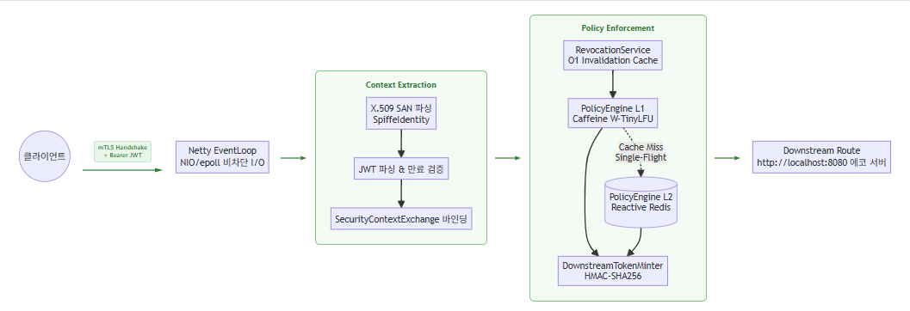
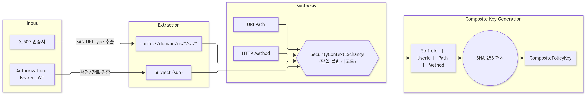
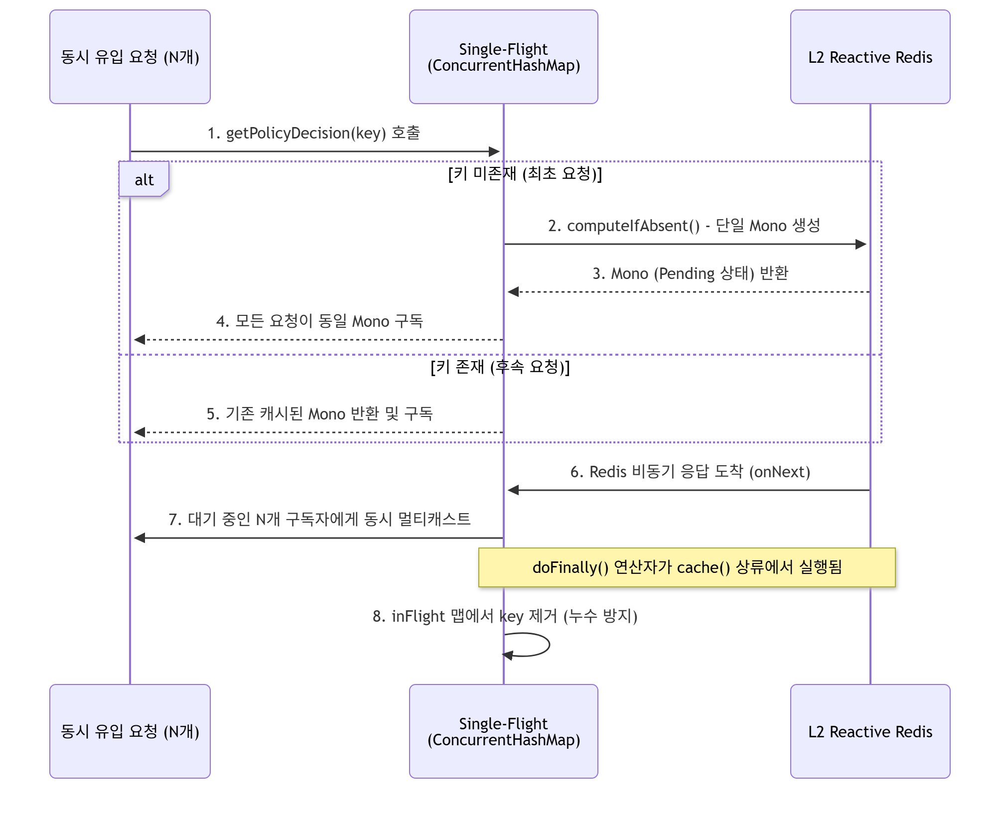

# 비차단 계층형 캐싱과 단일 비행(Single-Flight) 패턴을 적용한 고성능 제로 트러스트 API 게이트웨이 설계 및 성능 평가

---

## 국문 요약

본 논문은 제로 트러스트 API 게이트웨이 aegis-mesh를 제안한다. 이 시스템은 외부 인가 서버를 거치지 않고 게이트웨이 프로세스 내부에서 인가 정책 평가를 완료한다.

제안 시스템은 세 가지 핵심 설계를 포함한다.

1. 이중 신원 합성 메커니즘을 적용하였다. mTLS SPIFFE 서비스 신원과 사용자 JWT를 단일 불변 객체(SecurityContextExchange)로 암호학적으로 결합한다.

2. 2계층 캐시 구조를 도입하였다. JVM 인메모리(L1)와 리액티브 Redis(L2)를 결합하여 외부 인가 서버로 향하는 네트워크 홉을 제거한다.

3. 단일 비행(Single-Flight) 패턴을 구현하였다. L1 캐시 만료 시 발생하는 동시 폭주 요청을 단일 Redis I/O로 병합하여 시스템 포화를 차단한다.

k6 기반 부하 테스트를 통해 계층형 캐시의 지연 억제 효과를 확인하였다. 시나리오별 완전 독립 단독 실행을 각 5회 반복 측정한 결과, 웜업 완료 후 L1 캐시 적중 시 응답 지연은 P50 5.55 ± 0.61 ms, P99 20.89 ± 5.00 ms, 최대 지연 범위 41.02–77.35 ms를 기록하였다. 전량 L1 캐시 미스 상황(P50 7.02 ± 1.43 ms, P99 26.89 ± 9.35 ms, 최대 지연 범위 53.35–108.05 ms)과 비교할 때 꼬리 지연(Tail Latency)이 단축되었음을 나타낸다.

JVM 초기 기동(Cold Start) 구간의 성능도 평가하였다. 초기 기동 구간에서도 P50 기준 7.07 ± 1.94 ms의 응답 지연을 기록하였다. JIT 컴파일러 웜업이 진행됨에 따라 최대 지연 시간은 평균 587.31 ms(범위 442.96–753.05 ms)에서 웜업 후 41.02–77.35 ms로 감소하였으며(평균 기준 약 86.8% 이상 감소), 이는 지연 시간이 점차 수렴하는 경향과 동시에 초기 기동 구간 자체의 실행 간 변동성이 상당함을 나타낸다.

극단적인 동시 부하 환경에서의 구조적 안정성도 확인하였다. 500명의 가상 사용자를 투입한 시나리오를 5회 반복 실행한 결과, 총 완료 요청 수는 평균 155,546 ± 17,927건이었으며 5회 모두 오류 없이 처리되어 100%의 가용성을 확인하였다. 다만 해당 구간의 최대 지연은 6.40–12.42초 범위로 나타나, 고동시성 조건에서는 큐잉 포화로 인한 꼬리 지연 증가가 동반됨을 확인하였다.

**핵심어:** 제로 트러스트, API 게이트웨이, mTLS, SPIFFE, 리액티브 시스템, 캐시 스탬피드, 단일 비행 패턴, Spring Cloud Gateway

---

## Abstract

This paper presents the design and implementation of `aegis-mesh`, an in-process Zero-Trust API gateway that completes authorization policy evaluation entirely within the gateway process, without delegating to an external authorization server. The proposed system incorporates three core designs: (1) a dual-identity synthesis mechanism that cryptographically binds an mTLS SPIFFE service identity with a user JWT into a single immutable `SecurityContextExchange` record; (2) a two-tier cache combining in-memory Caffeine (L1) with reactive Redis (L2) to eliminate network hops to external authorization servers; and (3) a Single-Flight pattern that coalesces concurrent stampeding requests upon L1 cache expiry into a single Redis I/O operation.

Using a k6-based load test with five independent repetitions per scenario, we evaluated the latency-suppression effect of the tiered cache under warmed-up runtime conditions. The L1 cache hit path achieved a median (P50) latency of 5.55 ± 0.61 ms, a P99 of 20.89 ± 5.00 ms, and a maximum latency ranging from 41.02 to 77.35 ms across runs. Compared with the forced L1-cache-miss path (P50 of 7.02 ± 1.43 ms, P99 of 26.89 ± 9.35 ms, and a maximum ranging from 53.35 to 108.05 ms), this indicates a reduction in tail latency.

We also evaluated performance during the JVM cold-start phase across five independent restarts. At cold start, the median (P50) latency was 7.07 ± 1.94 ms, and the maximum latency averaged 587.31 ms (range: 442.96–753.05 ms). As JIT compiler warm-up progressed, the maximum latency dropped to the 41.02–77.35 ms range observed in the warmed-up runs — a reduction of roughly 87% or more on average — indicating both a converging latency trend and considerable run-to-run variability during the cold-start phase itself.

Finally, structural stability under extreme concurrent load was confirmed across five repetitions: in a stress scenario with 500 virtual users, the gateway processed an average of 155,546 ± 17,927 requests per run with zero errors in every run, confirming 100% availability. However, maximum latency in this scenario ranged from 6.40 to 12.42 seconds, indicating that queueing saturation accompanies tail-latency growth under high concurrency.

**Keywords:** Zero Trust, API Gateway, mTLS, SPIFFE, Reactive Systems, Cache Stampede, Single-Flight Pattern, Spring Cloud Gateway

---

## I. 서론

### 1.1 연구 배경 및 문제 제기

전통적인 네트워크 경계 기반 보안 모델은 마이크로서비스 환경에서 한계를 나타낸다. 클러스터 내부망에 대한 암묵적 신뢰(Implicit Trust)는 더 이상 유효한 전제로 간주되지 않는다. 이러한 배경에서 NIST SP 800-207 [1]은 제로 트러스트 아키텍처(ZTA)를 표준화하였다. ZTA는 네트워크 위치와 무관하게 모든 접근 요청을 명시적으로 검증한다. 이를 구현하기 위해 현대 클라우드 네이티브 인프라는 상호 TLS(mTLS) 기반의 서비스 신원 인증과 세분화된 접근 제어(ABAC/RBAC)를 필수적으로 요구한다.

하지만 엄격한 보안 검증은 지연 시간 증가라는 직접적인 트레이드오프를 발생시킨다. 특히 꼬리 지연(Tail Latency)은 시스템의 서비스 수준 목표(SLO) 위반을 초래하는 핵심 요인이다. 이러한 지연 문제는 기존 인프라가 채택한 구조적 한계에서 기인한다.

### 1.2 기존 접근법의 한계

서비스 메시(Service Mesh) 분야의 일반적인 설계는 **사이드카 기반 분리 모델**이다. Istio/Envoy 조합 [2]은 각 마이크로서비스 인스턴스 인접 위치에 Envoy 프록시 컨테이너를 배치하고, 외부 정책 엔진인 Open Policy Agent(OPA)를 인가 결정 서버로 연동한다.

이 구조에는 두 가지 본질적인 오버헤드가 수반된다.

**첫째, 네트워크 홉 증가이다.** 애플리케이션 컨테이너 $\rightarrow$ 사이드카 프록시 $\rightarrow$ OPA 서버의 경로로 최소 2개의 추가 네트워크 홉이 발생한다. 각 홉은 호스트 네트워크 또는 가상 네트워크 브리지를 통과하는 IPC 비용을 포함한다. Zhu et al. [3]은 서비스 메시 구성과 부하 조건에 따라 최대 185%의 지연 증가와 최대 92%의 가상 CPU 코어 추가 소모가 관측될 수 있음을 보고하였다. 트래픽 피크 시 이 오버헤드는 꼬리 지연을 가중시키는 요인으로 작용한다.

**둘째, 직렬화 오버헤드이다.** 인가 정책 평가를 위해 요청 컨텍스트를 JSON 등의 포맷으로 직렬화하여 외부 정책 엔진에 전달하고, 결과를 다시 역직렬화한다. 이 변환 작업은 요청당 CPU 사이클을 소모하여 시스템의 처리량 한계를 낮춘다.

또한 Envoy 사이드카는 JVM 힙 외부의 C++ 프로세스로 동작하므로, 자바 기반 마이크로서비스 게이트웨이와의 런타임 모델 차이가 발생한다. 비동기 논블로킹 파이프라인에서 사이드카 또는 외부 인가 서버로의 부가적 RPC 호출이 발생할 경우, 이벤트 루프의 블로킹 위험이 가중될 수 있다.

표 1은 기존 사이드카 모델과 본 연구에서 제안하는 인프로세스 통합 모델의 주요 아키텍처 특성을 대조한 결과이다.

**표 1.** 기존 사이드카 기반 분리 모델과 제안된 인프로세스 모델의 아키텍처 특성 비교

| 비교 항목 | 기존 사이드카 모델 (Envoy + OPA) | 제안 인프로세스 모델 (`aegis-mesh`) |
| :--- | :--- | :--- |
| **네트워크 홉 (Hop)** | 애플리케이션 $\leftrightarrow$ 프록시 $\leftrightarrow$ 인가 서버 (추가 2-Hop) | 게이트웨이 내부 통합 (추가 Hop 없음) |
| **메시지 직렬화/역직렬화** | JSON 등 외부 전송용 직렬화 필수 | JVM 내부 객체(불변 레코드) 참조로 직렬화 생략 |
| **상태(State) 캐싱** | OPA 자체 캐시 또는 프록시 레벨 분리 캐시 | L1(Caffeine) + L2(Redis) 통합 계층형 캐시 |
| **동시성 제어 구조** | 프록시·정책 서버가 별도 프로세스로 분리되어 있어, 캐시 스탬피드 방어 로직을 도입하려면 프로세스 간 조정(coordination)이 추가로 필요함† | 단일 프로세스 내 `ConcurrentHashMap` 기반 단일 비행(Single-Flight) 패턴으로 병발 요청을 직접 병합 |
| **프로세스 통신 비용** | 루프백(Loopback) 네트워크 IPC 오버헤드 발생 | 오버헤드 없는 힙 메모리 객체 지향 메서드 호출 |
| **스레드 모델** | 이종(C++ Envoy, Go OPA) 프로세스 간 비동기 결합 | Netty 이벤트 루프 내 통합 리액티브 파이프라인 |

† 이 항목은 실측 비교가 아닌 아키텍처 구조상의 저자 분석이다. Envoy/OPA 조합에서도 별도의 스탬피드 방어 계층(예: OPA 자체 캐싱, 클라이언트 측 요청 병합 라이브러리)을 구축하는 것이 불가능하지는 않으나, 프로세스 경계를 넘는 조정이 필요하다는 점에서 구조적 복잡도가 다르다. 참고문헌 [3]은 서비스 메시 프록시 계층의 지연 오버헤드를 실증하였으나, 스탬피드 방어의 상대적 난이도 자체를 직접 검증한 문헌은 아니다.

### 1.3 연구 기여

본 논문은 상기 한계를 완화하기 위해 인가 정책 평가 전 과정을 게이트웨이 프로세스 내부에서 완결하는 `aegis-mesh`를 설계하고 성능을 평가한다. 본 연구의 주요 기여는 다음 세 가지이다.

1. **인프로세스 이중 신원 합성:** mTLS SPIFFE ID와 사용자 JWT를 단일 불변 레코드로 암호학적으로 바인딩함으로써, Confused Deputy 공격을 아키텍처 수준에서 차단하는 메커니즘을 제안한다.
2. **계층형 캐시 메커니즘의 소거 검증 및 런타임 수렴 특성 규명:** 외부 사이드카와의 이종 환경 절대 비교 대신, 동일 파이프라인 내에서 L1 캐시 적중 경로, 강제 L1 미스 및 L2 Redis 경로, 고동시성 부하 경로를 단독 실행(Ablation Study)으로 격리 측정한다. 각 경로를 독립 세션에서 5회씩 반복 측정하여 통제된 웜업 환경에서 계층형 캐시의 지연 단축 효과와 그 반복 측정 편차를 함께 확인한다. 또한 초기 기동(Cold Start) 구간에서 발생하는 꼬리 지연 증가 현상이 웜업 과정을 통해 안정화되는 수렴 특성을 정량적으로 분석한다.
3. **단일 비행 패턴의 리액티브 구현 및 안정성 규명:** `ConcurrentHashMap`과 Reactor의 `.cache()` 연산자를 결합하여 캐시 스탬피드를 방어하는 구조를 구현한다. 또한 `.doFinally()` 연산자 배치 순서에 따라 리액티브 메모리 누수가 방지되는 조건을 분석한다.

---

## II. 배경지식 및 관련 연구

### 2.1 서비스 메시 사이드카 모델과 외부 인가 엔진

Syed et al. [4]은 제로 트러스트 아키텍처에 관한 포괄적 조사 연구에서 ZTA의 핵심 원칙과 함께 인증·접근 제어, 마이크로 세그멘테이션, 암호화, 보안 자동화 등 구현 요소를 체계적으로 정리하였으며, 각 접근법이 실제 ZTA 구현 시 직면하는 과제를 논의하였다. 본 연구가 다루는 서비스 신원 기반 인증과 세분화된 접근 제어는 이 분류 체계에서 ZTA 실현의 핵심 구성 요소로 제시된 영역에 해당한다.

서비스 메시는 이러한 ZTA 요구사항을 인프라 계층에서 충족하는 대표적 구현 방식이다. Istio [2]는 데이터 플레인으로 Envoy 프록시를 각 파드(Pod)의 사이드카로 주입하고 컨트롤 플레인에서 정책을 배포함으로써, mTLS·관측성·트래픽 제어를 애플리케이션 비즈니스 로직과 분리한다. Envoy의 외부 인가(ext_authz) 필터는 접근 제어 결정을 별도 인가 서버에 위임하는 방식으로 동작한다.

그러나 Zhu et al. [3]은 MeshInsight라는 분해적(decompositional) 분석 도구를 통해 서비스 메시의 오버헤드를 체계적으로 계측하였으며, 벤치마크 애플리케이션에서 최대 185%의 지연 증가와 최대 92%의 가상 CPU 코어 추가 소모를 보고하였다. 이 연구는 오버헤드의 주된 기여 요인이 구성 방식에 따라 달라짐을 지적하는데, 서비스 메시가 TCP 프록시로 동작할 때는 프로세스 간 통신(IPC)과 소켓 쓰기가, HTTP 프록시로 동작할 때는 프로토콜 파싱이 지배적이었다. 이는 본 연구가 제거 대상으로 삼은 인가 경로상의 IPC 및 직렬화 비용과 직접적으로 관련된다.

한편 Al Maruf et al. [5]은 마이크로서비스 원격 측정(telemetry) 데이터를 활용하여 서비스 의존 그래프(Service Dependency Graph)를 구축하고 아키텍처 스멜(smell)을 탐지하는 동적 분석 접근법을 제시하였다. 이 연구는 서비스 메시 오버헤드 자체를 정량화한 것은 아니나, 런타임 원격 측정 데이터를 통해 서비스 간 통신 구조를 관측·분석하는 방법론적 기반을 제공한다는 점에서 본 연구의 계측 관점과 맞닿아 있다.

### 2.2 SPIFFE/SPIRE와 워크로드 신원

SPIFFE(Secure Production Identity Framework for Everyone) [6]는 이기종 클라우드 환경에서 분산 워크로드 신원을 상호 운용 가능하도록 표준화한 CNCF 명세이다. SPIFFE ID는 `spiffe://<trust-domain>/ns/<namespace>/sa/<service-account>` 형식의 URI 스키마를 따르며, X.509 인증서의 SAN(Subject Alternative Name) 필드에 RFC 5280 [7]이 정의하는 URI 타입으로 인코딩된다.

`aegis-mesh`는 별도의 데몬 의존성 없이도 X.509 SPIFFE SAN 인증서를 Netty SSL 엔진 단계에서 직접 파싱하여 서비스 신원을 추출하도록 설계되었다. 이를 통해 SPIFFE 표준 명세를 준수하면서도 인프로세스 신원 파이프라인을 경량화할 수 있다.

### 2.3 리액티브 스트림과 이벤트 루프 모델

Welsh et al. [8]이 제안한 SEDA(Staged Event-Driven Architecture)는 동시성 서비스를 큐로 결합된 스테이지 파이프라인으로 분해하는 기초 원리를 정립하였다. 이 개념은 비동기 논블로킹 런타임의 이론적 토대가 되었다. 이후 표준화된 Reactive Streams 명세 [9]는 비동기 논블로킹 데이터 처리 시 생산자와 소비자 간의 속도 차이를 제어하는 배압(Backpressure) 인터페이스를 정의한다. Project Reactor는 이를 JVM 상에서 구현한 대표적 라이브러리이다.

이러한 비동기 I/O 패러다임은 운영체제가 제공하는 이벤트 통지 메커니즘을 활용하는 Netty 프레임워크를 통해 구현된다. Netty는 적은 수의 이벤트 루프 스레드로 대규모 동시 소켓 연결을 효율적으로 멀티플렉싱한다. 다만 Netty의 실제 transport 구현체는 실행 플랫폼에 따라 달라진다. Linux 환경에서는 `epoll` 기반 `EpollEventLoopGroup`을 사용할 수 있으나, Windows 등 `epoll`을 지원하지 않는 플랫폼에서는 Java NIO `Selector` 기반의 `NioEventLoopGroup`으로 폴백하며, 본 연구의 실험 환경도 이에 해당한다(4.1절 표 2 참조). 두 구현 모두 이벤트 기반 비차단 멀티플렉싱이라는 동일한 설계 원리를 공유하지만, 커널 인터페이스 수준에서는 차이가 있다. 이벤트 루프 내에서 하나의 블로킹 I/O나 장기 CPU 연산이 발생하면, 해당 스레드에 할당된 모든 채널의 처리가 중단된다. 따라서 리액티브 파이프라인 전반에서 동기식 블로킹 호출은 배제되어야 한다.

---

## III. 시스템 아키텍처 및 설계

### 3.1 전체 파이프라인 구조

`aegis-mesh`는 Spring Cloud Gateway 및 Netty 이벤트 루프 기반으로 구축되었다. 클라이언트의 인바운드 요청은 일련의 논블로킹 필터를 순차적으로 통과한다. 그림 1은 시스템의 전체 요청 처리 파이프라인과 필터 체인 구조를 나타낸다.

### 3.2 mTLS SPIFFE ID 파싱 및 이중 신원 합성

#### 3.2.1 SPIFFE SAN 추출

`ContextExtractionGatewayFilterFactory`는 Netty SSL 핸드셰이크 완료 시점에 피어 X.509 인증서를 추출한다. mTLS 핸드셰이크는 RFC 8446 [10] TLS 1.3 규격에 따라 피어 인증서 교환 및 서명 검증을 수행한다. 필터는 인증서의 SAN 목록에서 URI 타입(코드 6) 항목을 순회하며 `spiffe://` 접두사를 탐색한다.

정규식 매칭(`^spiffe://[^/]+/ns/([^/]+)/sa/([^/]+)$`)을 통해 네임스페이스와 서비스 계정을 추출한 뒤 불변 객체인 `SpiffeIdentity`를 생성한다. 인증서가 누락되었거나 유효한 SPIFFE URI가 없는 요청은 RFC 9457 [11] Problem Details 형식의 401 Unauthorized 오류로 즉시 단락(Short-circuit) 처리된다.

#### 3.2.2 JWT 검증 및 불변 신원 바인딩

mTLS 검증을 통과한 요청의 `Authorization` 헤더에서 Bearer 토큰을 추출한다. 본 시스템은 CPU 자원 고갈 공격(Crypto DoS)을 방어하기 위해, 연산 비용이 높은 암호학적 서명 검증을 수행하기 전에 JWT를 단순 디코딩하여 토큰 고유 식별자(JTI)를 먼저 추출하고, O(1) 시간 복잡도의 블랙리스트 조회를 통해 무효화 여부를 우선 대조한다. 블랙리스트에 존재하지 않는 토큰에 한하여 서명, 유효 기간(`exp`), 주체(`sub`)를 필수적으로 검증하고, 발급자(`iss`)와 수신자(`aud`) 클레임에 대해서는 형식적 유효성(공백 및 빈 리스트 여부)을 우선 점검하며, 분산 노드 간 시계 오차를 고려해 60초의 마진(Clock Skew)을 부여한다.

추출된 서비스 신원과 사용자 신원은 다음 구조의 단일 불변 레코드 `SecurityContextExchange`로 합성된다:

$$\text{SecurityContextExchange} = \langle \text{serviceIdentity}, \text{userIdentity}, \text{method}, \text{path} \rangle$$

Java 레코드의 불변성(Immutability)은 다수의 이벤트 루프 스레드가 동시 참조하더라도 명시적 락(Lock) 없이 스레드 안전성과 안전한 게시(Safe Publication)를 보장한다.

#### 3.2.3 Confused Deputy 공격 차단

시스템은 서비스 신원과 사용자 신원을 독립적으로 평가하지 않고, 복합 정책 키(`CompositePolicyKey`)로 결합하여 하나의 원자적 단위로 인가를 평가한다. 이때 해시 충돌(Hash Collision)을 악용한 정책 우회를 원천 차단하기 위해, 각 필드 사이에 명시적인 길이 접두사(Length-prefix)와 고정 구분자를 삽입하여 직렬화한 뒤 해싱을 수행한다:

$$\text{Key} = \text{SHA-256}(\text{len(sId)}\!:\!\text{sId} \parallel \text{len(uId)}\!:\!\text{uId} \parallel \text{len(res)}\!:\!\text{res} \parallel \text{len(act)}\!:\!\text{act})$$

이 해시 연산은 가변 길이의 복합 식별자를 고정 크기 256비트 캐시 키로 단축하기 위한 인덱스 산출 목적으로 수행된다. 인가 결정의 실질적 암호학적 근거는 앞서 수행된 mTLS X.509 인증서 체인 검증과 JWT HMAC-SHA256 서명 검증 단계에서 이미 확립되며, 복합 키는 이 두 검증을 통과한 신원 정보를 단일 캐시 엔트리로 통합하는 역할을 담당한다.

이 구조는 호출 주체 A가 위임자 X의 자격으로 리소스 R에 대해 액션 V를 수행하는 행위 전체를 단일 정책 명제로 검증한다. 따라서 서비스 A가 손상되어 권한 외의 자원에 무단 접근을 시도하더라도, 복합 키 매칭이 실패함으로써 Confused Deputy 공격이 차단된다. 그림 2는 이러한 신원 합성(SPIFFE SAN + JWT) 및 복합 정책 키 생성 흐름을 도식화한 것이다.

### 3.3 계층형(L1/L2) 캐시 아키텍처

#### 3.3.1 L1 Caffeine 인메모리 캐시 및 능동 무효화

L1 캐시는 JVM 힙 내에 최대 10,000개 엔트리를 유지하도록 구성된다. 캐시 방출 정책으로는 Einziger et al. [13]이 제안한 W-TinyLFU(Window TinyLFU) 알고리즘이 적용된다. W-TinyLFU는 Count-Min Sketch를 기반으로 항목의 접근 빈도를 추정하며, 적은 메모리 오버헤드로 높은 캐시 적중률을 나타낸다. W-TinyLFU는 `maximumSize` 설정 시 Caffeine의 내장 기본 동작으로 적용되며, 이를 활성화하기 위한 별도의 API 호출은 요구되지 않는다.

데이터 최신성을 유지하기 위해 기본 5분의 TTL 외에 Redis Pub/Sub 기반의 `PolicyInvalidationListener`를 구동한다. 권한 회수나 정책 수정 발생 시 무효화 이벤트가 브로드캐스트되며, 게이트웨이 인스턴스는 해당 복합 키를 L1 캐시에서 즉시 축출한다. 무효화 메시지가 와일드카드 접미사(`*`)를 포함하는 경우, 해당 접두사에 매칭되는 모든 캐시 엔트리를 일괄 축출하는 접두사 매칭 무효화를 지원한다. 이를 통해 특정 서비스 계정 또는 네임스페이스 단위의 정책 일괄 회수를 단일 이벤트로 처리할 수 있다.

#### 3.3.2 L2 리액티브 Redis 캐시

L1 캐시 미스 시 호출되는 L2 캐시는 Spring Data Redis Reactive를 기반으로 완전 논블로킹 방식으로 동작한다. Redis I/O 대기 시간 동안 이벤트 루프 스레드는 블로킹되지 않고 즉시 다른 채널의 패킷 처리를 위해 반환된다. Redis 응답이 수신되면 리액티브 스트림 인터페이스 [9]의 배압 프로토콜에 따라 다운스트림 파이프라인 처리가 재개된다.

현 구현에서 정책 결정은 Redis에 사전 등록된 복합 키별 허용/거부 레코드 조회에 기반한다. 해당 키가 Redis에 등록되지 않은 경우, 정적으로 구성된 허용 목록(`policy-allowlist`)과의 대조를 통해 기본 거부(Deny-by-Default) 정책이 적용된다. 이때 Redis 조회 시 누락되어 `DENY`로 결정된 결과 역시 L1 캐시에 동일하게 5분간 캐싱되어 반복적인 무효 요청에 대한 인프라 부하를 방어한다. 동적 속성 기반 정책 평가(ABAC) 엔진과의 통합은 향후 확장 과제로 남긴다.

#### 3.3.3 RevocationService 독립 무효화 캐시

사용자 토큰 탈취 등에 신속하게 대응하기 위해, `RevocationService`는 인가 정책과 분리된 독립적인 O(1) 무효화 캐시를 운용한다. 이 서비스는 `policy-invalidation`과 별개로 운영되는 `token:revocation` Redis Pub/Sub 채널을 구독한다. 무효화된 SPIFFE ID 또는 JWT JTI(토큰 고유 식별자)가 수신되면, TTL 24시간, 최대 100,000개 엔트리로 구성된 전용 Caffeine 캐시에 즉시 등록된다. 이 TTL은 발급된 토큰의 최대 생존 시간과 겹치도록(overlap) 설정되어, 만료되기 전까지의 블랙리스트 유지를 보장한다. 시스템은 요청 처리 초기 단계(Context Extraction)에서 JTI 무효화 여부를 1차로 선조회하고, 이후 인가 정책 평가 직전에 SPIFFE ID 무효화 여부를 최종 검증하여 취소된 신원을 차단한다. `token:revocation`과 `policy-invalidation` 채널의 독립적 운용은 두 무효화 관심사 간의 결함 격리(Fault Isolation)를 제공하며, 어느 한 채널에서 오류가 발생하더라도 나머지 채널의 처리 흐름에 영향을 미치지 않는다.
### 3.4 단일 비행(Single-Flight) 패턴

#### 3.4.1 캐시 스탬피드 제어

특정 정책 키의 L1 캐시가 만료된 직후 대규모 동시 요청이 유입될 경우, 모든 요청이 일제히 L2 Redis로 질의를 전송하는 캐시 스탬피드(Thundering Herd) 현상이 유발될 수 있다. 본 시스템은 진행 중인 I/O를 단일 흐름으로 병합하는 단일 비행 패턴을 리액티브 파이프라인으로 설계하여 이를 해결한다.

#### 3.4.2 논블로킹 동시성 병합 및 연산자 순서

`PolicyEngine`은 `ConcurrentHashMap<String, Mono<PolicyDecision>>`을 통해 현재 진행 중인 Redis 조회를 추적한다. `computeIfAbsent`의 원자성을 기반으로 동일 키에 대한 질의는 단 하나의 `Mono` 퍼블리셔만 생성한다. 그림 3에서 볼 수 있듯이, 단일 비행 패턴은 다수의 병발 요청을 효율적으로 단일 비동기 스트림으로 병합하고 멀티캐스팅한다.

이 구현에서 연산자의 배치 순서는 메모리 안정성에 중요한 영향을 미친다. `.doFinally()`가 `.cache()` 하류에 위치하면, 클라이언트 연결 조기 종료 등에 따른 구독 취소(CANCEL) 신호가 `.cache()` 내부에서 흡수되어 상류로 온전히 전파되지 못할 위험이 있다. 이 경우 `inFlight` 맵에서 해당 키가 제거되지 않는 메모리 누수가 발생할 수 있다. 따라서 `.doFinally()`를 `.cache()` 상류에 전진 배치하여 맵 정리가 확실하게 보장되도록 방어하였다. 다만 이 구조에서는 최초 구독자가 조기 취소할 경우 캐싱이 완료되기 전에 `inFlight`에서 항목이 제거되므로, 동일 시점에 대기 중이던 후속 요청들이 병합되지 못하고 개별적으로 재시도될 수 있는 트레이드오프가 수반된다.

### 3.5 내부 토큰 전환 및 오프힙 메모리 안전성

인가가 승인된 요청에 대해 `DownstreamTokenMinter`는 HMAC-SHA256으로 서명된 60초 만료의 내부 전용 토큰을 발급한다. 내부망에서의 토큰 재전송(Replay) 공격을 방지하기 위해, 발급되는 토큰에는 고유 식별자(JTI)를 부여하고 대상 서비스(`aud`)를 명시적으로 바인딩한다. 게이트웨이는 원본 클라이언트 토큰을 헤더에서 제거하고 `X-Internal-Identity` 헤더로 변환된 토큰을 주입한다(RFC 9110 [14]). 이를 통해 내부 마이크로서비스는 연산 비용이 높은 비대칭 키 검증 대신 경량 대칭키 검증만을 수행할 수 있다. 서명 키는 `AtomicReference<ActiveKey>`로 관리되며, 런타임 중 `rotateSecret()` 메서드 호출을 통해 무중단 키 교체가 가능하도록 설계되었다. 발급된 내부 토큰은 JWS `kid` 헤더를 포함하므로 수신 측이 키 버전을 식별할 수 있으며, 외부 트리거(관리 API 또는 이벤트 기반 회전)의 구현은 향후 과제로 남긴다.

아울러 오류 응답 경로(Error Response Path)에 한하여, 응답이 이미 커밋된 상태에서의 중복 버퍼 할당을 방지하기 위해 버퍼 생성 시점을 `Mono.fromCallable()`을 통해 실제 HTTP 전송 구독 시점까지 지연(Deferred Allocation)시키는 방식을 적용하였다.

`DownstreamTokenMinter.mintInternalToken()`은 서명 키 상태가 미초기화된 경우 명시적 예외를 발생시켜 인가를 거부하도록 구현하였다. 이는 예외 상황에서 기본 허용(Fail-Open)이 아닌 기본 거부(Fail-Secure) 원칙을 코드 수준에서 관철한 설계이다.

시스템의 내부 상태는 Micrometer 계측 인프라를 통해 실시간으로 노출된다. L1 캐시 적중/미스(`aegis.policy.cache.l1.hits/misses`), L2 Redis 조회 지연(`aegis.policy.cache.l2.latency`), 인증 거부 사유별 카운터(`aegis.security.auth.rejections`), 단일 비행 중복 제거 건수(`aegis.policy.singleflight.deduplicated`) 등의 지표가 Prometheus 엔드포인트 및 Server-Sent Events(SSE) 기반 실시간 스트림으로 제공된다. 이 관측성 인프라는 계층별 캐시 동작의 정량적 분리 측정을 지원하며, 본 논문의 소거 연구를 위한 계측 기반으로 활용되었다.

---

## IV. 성능 평가 및 결과 분석

본 절에서는 외부 시스템과의 단순 1:1 비교를 지양하고, 시스템 내부의 계층별 캐싱 메커니즘과 런타임 요인이 지연에 미치는 영향을 정량적으로 규명하기 위해 시나리오별 단독(Isolated) 실행을 통한 소거 연구(Ablation Study)를 수행한다. 모든 시나리오는 측정 반복성 확보를 위해 완전히 독립된 세션에서 각 5회씩 반복 실행하였다.

### 4.1 실험 환경

실험 환경의 구성 요소를 표 2에 요약한다. 모든 구성 요소는 동일 호스트 내에서 도커 컨테이너 및 네이티브 프로세스로 구동되어 단일 노드 자원을 공유한다.

이벤트 루프 내 블로킹 호출 부재를 지속적으로 검증하기 위해 BlockHound 라이브러리를 테스트 스위트 전반에 적용하였다. 모든 단위 테스트 및 통합 테스트는 BlockHound를 설치한 `BaseBlockHoundTest`를 기반 클래스로 상속하며, 이벤트 루프 스레드에서 블로킹 I/O가 감지되는 즉시 예외로 처리된다. 또한 k6 부하 생성기는 자체 서명 인증서 환경에서의 실험 편의를 위해 서버 인증서 체인 검증을 생략(`insecureSkipTLSVerify`)하도록 설정하였다. 이는 실험 환경에 한정된 설정이며, 운영 환경에서는 별도의 CA 신뢰 체계 구성이 요구된다.

**표 2.** 실험 환경 구성 요약

| 구성 요소 | 사양 및 설정 |
| --- | --- |
| 호스트 환경 | Windows 11 64-bit |
| 런타임 | Java 21 LTS, Spring Cloud Gateway 4.x (Windows 네이티브 JVM 프로세스로 실행) |
| 이벤트 루프 | Netty (NIO 기반 논블로킹 I/O), TLS 포트 8443 |
| L1 캐시 | Caffeine W-TinyLFU (최대 10,000 엔트리, TTL 5분) |
| L2 캐시 | Redis 7.2-alpine (Docker 컨테이너, localhost:6379) |
| 다운스트림 | HTTP 에코 서버 (localhost:8080) |
| 부하 생성기 | Grafana k6 (mTLS 클라이언트 인증서 및 동적 HS256 JWT 서명) |
| 인증 체계 | OpenSSL 기반 자체 서명 SPIFFE SAN X.509 인증서 (RFC 5280) |
| 측정 범위 | 종단 간(End-to-End), k6 HTTP 클라이언트의 연결 재사용(keep-alive) 기준 — 최초 mTLS 핸드셰이크 이후 요청은 기존 연결 재사용 |

> **참고:** 게이트웨이 프로세스는 Windows 네이티브 JVM에서 실행되었으며, Netty는 `epoll` 대신 Java NIO `Selector` 기반의 `NioEventLoopGroup`을 사용한다. Redis만 Docker 컨테이너(Linux 커널) 내에서 별도로 구동되었다.

### 4.2 부하 테스트 시나리오 구성

벤치마크 스위트는 환경변수(`TARGET_SCENARIO`)를 통해 각 시나리오를 독립된 단독 세션으로 순차 실행하도록 설계되었다. 아래 4개 시나리오를 각각 5회씩 완전히 독립된 세션으로 반복 실행하였으며, 시나리오 A(Cold Start)는 매 반복마다 게이트웨이 프로세스를 재시작한 직후 측정하였다.

1. **시나리오 A (L1 Warm Cache - Cold Start, 30초):** 게이트웨이 JVM 프로세스를 완전히 종료한 뒤 재기동한 직후, 사전 웜업 트래픽 없이 20 VU(Virtual Users) 고정 부하로 정적 경로(`/api/resource/static-warm`)를 호출하여 L1 Caffeine 캐시 적중 시의 초기 기동 성능을 측정한다.
2. **시나리오 A (L1 Warm Cache - Warmed-up, 30초):** 위 Cold Start 측정 완료 직후 JIT 최적화가 수렴된 상태에서 동일한 정적 경로를 20 VU 고정 부하로 재호출하여 순수 L1 캐시 적중 성능을 측정한다.
3. **시나리오 B (L2 Cold Cache - Warmed-up, 30초):** JIT 최적화가 유지된 상태에서 매 요청마다 난수화된 동적 경로(`/api/resource/dynamic-{id}`)를 호출하여 의도적으로 L1 캐시 미스를 유발하고 L2 Redis 비동기 쿼리 성능을 측정한다.
4. **시나리오 C (고동시성 스트레스, 2분):** 앞선 시나리오들을 거치며 JVM JIT 최적화가 누적 완료된 런타임 위에서 가상 사용자를 0 $\rightarrow$ 500 VU로 급격히 램프업하며, L1 미스(80%)와 적중(20%) 혼합 경로를 주입하여 극단 부하 조건에서의 가용성과 큐잉 특성을 검증한다. 이 80%/20% 비율은 k6 스크립트상 설계된 목표 트래픽 분배값이며, Caffeine 메트릭으로 실측 검증된 히트율은 아니다.

모든 시나리오의 통계적 일관성을 위해 k6 실행 시 `--summary-trend-stats="min,avg,med,p(90),p(95),p(99),max"` 옵션을 적용하여, 전 구간 백분위를 동일한 규격으로 계측하였다.

### 4.3 실측 벤치마크 결과

표 3은 시나리오별로 완전히 독립된 세션에서 5회씩 반복 실행하여 수집한 실측 성능 지표이다. 지연시간 지표(Min, Avg, P50, P90, P95, P99)는 5회 반복의 평균 ± 표준편차로 제시하며, Max는 극단치 특성상 평균±표준편차 대신 5회 중 관측된 최소–최대 범위로 표기한다. 모든 수치는 k6 원본 실행 로그에서 직접 추출하였다.

**표 3.** 시나리오별 단독 실행 실측 벤치마크 결과 (평균 ± 표준편차, n=5 반복)

| 측정 지표 | 시나리오 A (Cold Start) | 시나리오 A (Warmed-up) | 시나리오 B (L2 Cold, Warmed-up) | 시나리오 C (500 VU Stress) |
| --- | --- | --- | --- | --- |
| 활성 가상 사용자 (VU) | 20 고정 | 20 고정 | 20 고정 | 0 $\rightarrow$ 500 램프업 |
| 런타임 웜업 상태 | 기동 직후 (Cold, 매회 재시작) | 워밍업 완료 (Warmed) | 워밍업 완료 (Warmed) | 워밍업 누적 (피크 부하) |
| 캐시 트래픽 구성 | 100% L1 적중 (요청 경로 고정) | 100% L1 적중 (요청 경로 고정) | 100% L1 미스 유도 (동적 경로 강제) | 목표 분배: L1 미스 80% / 적중 20%‡ |
| 테스트 지속 시간 | 30초 | 30초 | 30초 | 120초 (2분) |
| 반복 횟수 | 5 | 5 | 5 | 5 |
| 총 완료 요청 수 | 26,036 ± 4,555건 | 32,960 ± 1,984건 | 30,764 ± 3,594건 | 155,546 ± 17,927건 |
| 초당 처리량 (RPS) | 867.09 ± 151.80 req/s | 1,097.88 ± 66.15 req/s | 1,024.42 ± 119.92 req/s | 1,295.96 ± 149.34 req/s |
| HTTP 성공률 (200 OK) | 100.00% (5/5회) | 100.00% (5/5회) | 100.00% (5/5회) | 100.00% (5/5회) |
| 연결 오류율 / HTTP 에러 | 0.00% | 0.00% | 0.00% | 0.00% |
| 최소 지연 (Min) | 1.14 ± 0.42 ms | 1.04 ± 0.01 ms | 1.87 ± 0.29 ms | 1.58 ± 0.02 ms |
| 평균 지연 (Avg) | 11.74 ± 4.24 ms | 6.60 ± 0.91 ms | 8.44 ± 2.21 ms | 152.95 ± 23.13 ms |
| 중위 지연 (P50 / Med) | 7.07 ± 1.94 ms | 5.55 ± 0.61 ms | 7.02 ± 1.43 ms | 125.74 ± 21.04 ms |
| 상위 90% 지연 (P90) | 24.80 ± 11.81 ms | 10.91 ± 2.14 ms | 14.13 ± 5.05 ms | 304.99 ± 35.07 ms |
| 상위 95% 지연 (P95) | 34.12 ± 13.92 ms | 13.75 ± 2.86 ms | 17.45 ± 5.86 ms | 377.65 ± 45.61 ms |
| 상위 99% 지연 (P99) | 60.55 ± 18.51 ms | 20.89 ± 5.00 ms | 26.89 ± 9.35 ms | 526.87 ± 55.64 ms |
| 최대 지연 (Max, 범위) | 442.96 – 753.05 ms | 41.02 – 77.35 ms | 53.35 – 108.05 ms | 6,401.46 – 12,417.11 ms |

‡ k6 스크립트상 설계된 트래픽 분배 목표값이며, Caffeine 메트릭을 통한 실측 히트율 검증 값은 아니다.

### 4.4 데이터 심층 분석 및 고찰

#### 계층형 캐시(L1 vs L2) 소거 연구 검증

동일하게 JVM 웜업을 완료한 조건에서 시나리오 A(Warmed-up)와 시나리오 B(Warmed-up)를 5회씩 반복 비교하면, 계층형 캐시 아키텍처가 지연 시간 단축에 미치는 효과를 확인할 수 있다. 표 3에서 확인되듯이, L1 캐시 적중 시(시나리오 A-Warmed) P50 지연은 5.55 ± 0.61 ms를 기록한 반면, 전량 L1 캐시 미스로 인해 Redis I/O가 개입하는 시나리오 B에서는 P50 지연이 7.02 ± 1.43 ms로 증가하였다. 이러한 우위는 P90(10.91 ms vs 14.13 ms), P95(13.75 ms vs 17.45 ms), P99(20.89 ms vs 26.89 ms) 전 구간에서 5회 반복 평균 기준으로 일관되게 관찰되었다. 이는 로컬 루프백 소켓 통신을 통한 Redis RTT 및 직렬화/역직렬화에 수반되는 오버헤드가 반영된 결과로 해석된다. 다만 두 시나리오 모두 반복 실행 간 표준편차가 평균의 20~40% 수준으로 나타나, 단일 호스트 환경에서의 실행 간 변동성이 상당함에 유의할 필요가 있다.

#### JVM JIT 웜업 및 꼬리 지연 수렴 특성

시나리오 A의 Cold Start 측정과 Warmed-up 측정 간의 대조는 클라우드 네이티브 환경에서 JVM 기반 게이트웨이 운용 시 중요한 런타임 거동을 시사한다. 기동 직후(Cold Start) 구간에서도 게이트웨이의 중위 지연(P50)은 7.07 ± 1.94 ms로 나타났으나, HotSpot 컴파일러의 C1/C2 JIT 최적화가 완료되지 않아 최대 지연은 5회 평균 587.31 ms(관측 범위 442.96–753.05 ms)까지 상승하였다. 반면 웜업 트래픽을 거친 후에는 최대 지연이 41.02–77.35 ms 범위로 감소하였으며, 평균 기준으로 약 87% 이상 감소한 것으로 나타나 꼬리 지연이 수렴하는 특성을 확인하였다.

한편 Cold Start 구간의 총 완료 요청 수는 5회 반복에서 19,218건에서 30,753건까지 상당한 편차를 보였다(평균 26,036 ± 4,555건, 변동계수 약 17.5%). 이는 JVM 재시작 직후 클래스 로딩 및 JIT 컴파일 진행 상태가 매 실행마다 달라짐에 따라, Cold Start 구간 자체의 처리량과 지연 분포가 실행 간에 상당한 변동성을 가짐을 시사한다. 이러한 변동성은 Cold Start 구간을 프로덕션 SLO 산정에 반영할 때 단일 측정값이 아닌 분포 형태로 고려해야 함을 뒷받침하는 정량적 근거로 해석할 수 있다.

#### 고동시성 스트레스(시나리오 C)와 무손실 복원력

시나리오 C에서는 500 VU 피크 구간에서 P50 125.74 ± 21.04 ms, P99 526.87 ± 55.64 ms, 최대 지연이 5회 반복에서 6.40초에서 12.42초 사이(평균 약 9.31초)로 상승하였으며, 이는 큐잉 포화(Queueing Saturation) 현상으로 해석된다. 시나리오 A/B의 개별 요청 지연(수 ms 단위)과 비교할 때, 시나리오 C의 지연은 수십에서 수백 배 수준으로 증가하였다. 이는 단일 호스트 환경에서 게이트웨이, Redis, 부하 생성기가 CPU 자원을 공유함에 따른 스케줄링 경합의 영향으로 판단되며(5.1절 참조), 분산 환경에서는 개선될 여지가 있다.

다만 이러한 지연 증가에도 불구하고, 5회 반복 모두에서 총 155,546 ± 17,927건의 요청이 단 1건의 소켓 연결 실패나 HTTP 오류 없이 처리되어, 큐잉 지연 자체는 발생하되 요청 유실이나 연결 단절 없이 시스템이 견뎌내는 **가용성 관점의 복원력**이 반복적으로 확인되었다. 즉, 본 결과는 "저지연 유지"가 아닌 "무손실 처리"라는 제한적 의미에서의 안정성 확인으로 해석함이 정확하다.

### 4.5 단일 비행 패턴 및 일관성 검증

`PolicyEngineStampedeTest`를 통해 동일 키에 대한 100개의 동시 요청을 주입한 결과, 실제 L2 Redis 네트워크 호출은 정확히 1회만 발생하였으며 나머지 99개 요청은 첫 번째 비동기 스트림 결과를 공유받아 처리되었다. 이는 Micrometer 메트릭(`aegis.policy.singleflight.deduplicated = 99`)을 통해 정량적으로 확인되었다.

아울러 Testcontainers를 이용한 `CacheCoherencyIntegrationTest`에서 Redis Pub/Sub을 통한 무효화 메시지 발행 시, 단일 인스턴스 루프백 네트워크 환경 기준으로 100 ms 이내에 로컬 L1 캐시 엔트리가 축출됨을 확인하였다. 이는 단일 노드 환경에서의 결과이며, 다중 레플리카 분산 환경에서의 전파 지연 및 일관성 보장 수준은 §5.2에서 논의한다.

---

## V. 연구의 한계점 및 향후 과제

### 5.1 단일 노드 로컬 측정의 한계 및 런타임 변동성

본 실험은 단일 호스트 환경에서 수행되었으므로, 게이트웨이와 보조 프로세스 간의 CPU 스케줄링 간섭이 수반되었다. 시나리오 C에서 5회 반복 시 관측된 최대 지연(6.40–12.42초 범위)은 분산 네트워크 환경에서의 순수 네트워크 RTT보다 로컬 CPU 경합에 따른 큐잉 지연 효과가 지배적으로 작용한 결과로 판단된다. 또한 시나리오 A(Cold Start)의 총 요청 수가 5회 반복에서 19,218건에서 30,753건까지 편차를 보인 점 역시, 단일 호스트에서 게이트웨이·Redis·부하 생성기가 자원을 공유함에 따른 실행 간 변동성을 시사한다. 향후 연구에서는 Kubernetes 클러스터 환경에서 게이트웨이와 워크로드를 독립 노드로 격리 배치하여, 정밀한 지연 프로파일을 분리 측정할 필요가 있다.

### 5.2 반복 측정 규모의 한계

본 연구는 시나리오별 완전 독립 실행을 5회씩 반복하여 평균과 표준편차를 산출하였다. 이는 단일 실행(n=1) 대비 재현성 측면에서 개선된 결과이나, 특히 Max와 같은 극단치 통계량은 5회 수준의 표본으로는 안정적인 신뢰구간을 산출하기에 제한적이다(예: 시나리오 C의 Max 표준편차는 평균의 약 28%에 달함). 향후 연구에서는 반복 횟수를 10회 이상으로 확대하고, 실행 순서에 따른 학습 효과(order effect)를 배제하기 위해 시나리오 실행 순서를 무작위화하는 방안을 고려할 필요가 있다.

### 5.3 분산 환경에서의 캐시 일관성 확장

본 연구에서 수행한 L1 캐시 일관성 검증은 단일 인스턴스 수준에 국한되었다. 다중 게이트웨이 레플리카 환경에서는 Redis Pub/Sub 메시지 유실 위험이나 네트워크 파티션 발생 시 인스턴스 간 인가 정보 불일치가 초래될 수 있다. 향후 Redis Sentinel 또는 Redis Cluster 기반의 신뢰성 있는 메시징과 분산 서킷 브레이커(Circuit Breaker)를 결합하여 내결함성을 강화하는 방안에 대한 연구가 필요하다. 또한 취소 캐시(`RevocationService`)의 TTL은 현재 24시간으로 고정되어 있어, 유효 기간이 이를 초과하는 장기 토큰이 운용되는 환경에서는 취소 항목이 조기 만료될 수 있다. 향후 취소 캐시의 TTL을 토큰의 `exp` 클레임에 연동하거나, Redis 영속 저장소를 기반으로 블랙리스트를 관리하는 방안의 검토가 필요하다.

### 5.4 커널 레벨 패킷 가속(eBPF) 연계

향후 성능 확장을 위해 eBPF(extended Berkeley Packet Filter)를 활용한 커널 레벨 패킷 가속 기법과의 연계를 검토할 수 있다. eBPF CNI를 통해 사용자 공간과 커널 공간 간의 컨텍스트 스위칭을 최소화하고 mTLS 레코드 계층 패킷 처리를 커널 단계에서 가속화할 경우, 처리량 상한이 더욱 향상될 수 있을 것으로 예상된다. 다만 본 연구의 실험 환경(Windows 네이티브 JVM)에서는 `epoll` 기반 커널 인터페이스를 직접 활용하지 않았으므로, 이러한 가속 기법의 효과는 Linux 기반 배포 환경에서 별도로 검증되어야 한다.

### 5.5 Java 가상 스레드 런타임 이관 검토

본 시스템은 Netty 기반의 순수 리액티브 모델을 채택하고 Java 21 가상 스레드(Project Loom)를 도입하지 않았다. Java 21 환경의 가상 스레드는 피닝(Pinning) 제약을 가지고 있었으나, JDK 24에서 확정된 JEP 491을 통해 해당 제약이 해소되었다. 따라서 향후 런타임을 JDK 24 이상으로 전환할 경우, 외부 정책 DB 질의와 같은 폴백(Fallback) 블로킹 I/O 경로에서 가상 스레드와 리액티브 파이프라인을 결합한 하이브리드 모델의 적용을 재검토할 필요가 있다.

### 5.6 권한 무효화 아키텍처의 분산 환경 한계

본 연구의 `RevocationService`는 단일 인스턴스 내에서 Caffeine 캐시 기반의 O(1) 블랙리스트 조회를 수행하도록 설계되었다. 그러나 이 구조는 다중 게이트웨이 인스턴스로 구성된 분산 환경에서 두 가지 한계를 지닌다.

첫째, 게이트웨이 노드에 네트워크 순단이 발생할 경우, Redis Pub/Sub의 Fire-and-Forget 특성상 전달되지 못한 권한 무효화 이벤트는 재전송되지 않고 유실된다. 이 경우 해당 노드는 이미 취소된 토큰을 계속 유효한 것으로 판단하는 상태 불일치(Silent Stale Cache)에 놓일 수 있다.

둘째, 로컬 블랙리스트 캐시의 용량은 최대 10만 개 엔트리로 제한되어 있다. 무효화된 토큰 수가 이 한도를 초과하면 W-TinyLFU 방출 정책에 따라 상대적으로 오래되거나 접근 빈도가 낮은 블랙리스트 항목이 축출될 수 있다. 이 경우 이미 취소되었던 토큰이 캐시에서 밀려나 다시 유효한 것으로 오인되어 통과되는 상태 고갈(State Exhaustion) 취약점이 발생할 수 있다.

향후 시스템 고도화 시 Redis Streams(`XREADGROUP`)를 도입하여 무효화 메시지의 전달을 보장(guaranteed delivery)하고, L1 캐시 미스 시 L2 Redis Set으로 폴백(Fallback) 조회하는 이중 확인 구조를 도입함으로써 위 두 한계를 완화할 수 있을 것으로 판단된다.

---

## VI. 결론

본 논문은 제로 트러스트 보안 검증을 외부 사이드카나 원격 인가 서버에 전적으로 위임하지 않고, 게이트웨이 프로세스 내부에서 완결하도록 설계된 `aegis-mesh`의 구조와 성능 특성을 제시하였다.

본 시스템은 mTLS SPIFFE 신원과 사용자 JWT를 Java 불변 레코드로 합성하여 Confused Deputy 취약점을 구조적으로 방어하였으며, W-TinyLFU 기반 L1 Caffeine 캐시와 리액티브 L2 Redis 캐시를 결합한 계층형 캐시 구조를 구성하였다. 아울러 동시 폭주 요청을 단일 I/O로 병합하는 단일 비행 패턴을 리액티브 스트림으로 구현하고 연산자 순서에 따른 메모리 안전성을 규명하였다.

시나리오별 완전 독립 실행을 5회씩 반복한 소거 연구 형태의 부하 테스트 결과, JVM 웜업 완료 후 L1 캐시 적중 조건(P50 5.55 ± 0.61 ms, P90 10.91 ± 2.14 ms, P99 20.89 ± 5.00 ms, 최대 지연 범위 41.02–77.35 ms)이 L2 Redis 조회 조건(P50 7.02 ± 1.43 ms, P99 26.89 ± 9.35 ms) 대비 지연 시간이 반복 평균 기준으로 일관되게 낮게 나타남을 확인하였다. 또한 초기 기동(Cold Start) 시 웜업을 통해 최대 지연이 평균 587.31 ms에서 41.02–77.35 ms 범위로 안정화되는 꼬리 지연 수렴 거동을 정량 분석하였으며, 이 과정에서 Cold Start 구간 자체의 처리량과 지연이 실행마다 상당히 변동함도 함께 확인하였다.

500 VU 극단 부하 조건에서는 5회 반복 모두 오류 없이 요청을 처리하여 100%의 가용성을 확인하였으나, 이 구간의 최대 지연은 6.40–12.42초까지 상승하여 큐잉 포화로 인한 꼬리 지연 증가가 동반되었다. 이는 본 시스템이 "무손실 처리"라는 가용성 관점에서는 높은 복원력을 보이지만, 극단적 동시성 조건에서 저지연을 유지하는 것과는 별개의 특성임을 시사한다. 다만 본 실험은 단일 호스트 환경에서 수행되었으며, 반복 횟수(n=5) 또한 극단치 통계량의 안정적 추정에는 제한적이므로, 후속 연구에서 분산 환경 검증과 반복 횟수 확대를 통한 재현성 보강이 필요하다. 본 연구의 결과는 클라우드 네이티브 환경에서 보안 검증 오버헤드를 제어하기 위한 아키텍처 설계 시 참고 가능한 기초 자료로 활용될 수 있다.

---

## 참고문헌

[1] S. Rose, O. Borchert, S. Mitchell, and S. Connelly, "Zero Trust Architecture," National Institute of Standards and Technology, NIST Special Publication 800-207, Aug. 2020. doi: 10.6028/NIST.SP.800-207.

[2] Istio Authors, "Istio Architecture," Istio Documentation, Cloud Native Computing Foundation. [Online]. Available: https://istio.io/latest/docs/ops/deployment/architecture/

[3] X. Zhu, G. She, B. Xue, Y. Zhang, Y. Zhang, X. K. Zou, X. Duan, P. He, A. Krishnamurthy, M. Lentz, D. Zhuo, and R. Mahajan, "Dissecting Service Mesh Overheads," arXiv preprint arXiv:2207.00592, Jul. 2022. doi: 10.48550/arXiv.2207.00592.

[4] N. F. Syed, S. W. Shah, A. Shaghaghi, A. Anwar, Z. Baig, and R. Doss, "Zero Trust Architecture (ZTA): A Comprehensive Survey," *IEEE Access*, vol. 10, pp. 57143–57179, 2022.

[5] A. Al Maruf, A. Bakhtin, T. Cerny, and D. Taibi, "Using Microservice Telemetry Data for System Dynamic Analysis," in *Proc. 16th IEEE Int. Conf. Service-Oriented System Engineering (SOSE)*, Newark, NJ, USA, 2022, pp. 29–38. doi: 10.1109/SOSE55356.2022.00010.

[6] SPIFFE Project, "The SPIFFE Standards: SPIFFE ID and SVID Specification," Cloud Native Computing Foundation (CNCF). [Online]. Available: https://github.com/spiffe/spiffe/tree/main/standards

[7] D. Cooper, S. Santesson, S. Farrell, S. Boeyen, R. Housley, and W. Polk, "Internet X.509 Public Key Infrastructure Certificate and Certificate Revocation List (CRL) Profile," IETF RFC 5280, May 2008.

[8] M. Welsh, D. Culler, and E. Brewer, "SEDA: An Architecture for Well-Conditioned, Scalable Internet Services," in *Proc. 18th ACM Symp. Operating Systems Principles (SOSP)*, 2001.

[9] Reactive Streams Steering Committee, "Reactive Streams Specification for the JVM," v1.0.4, 2022.

[10] E. Rescorla, "The Transport Layer Security (TLS) Protocol Version 1.3," IETF RFC 8446, Aug. 2018.

[11] M. Nottingham, E. Wilde, and S. Dalal, "Problem Details for HTTP APIs," IETF RFC 9457, Jul. 2023.

[12] M. Jones, J. Bradley, and N. Sakimura, "JSON Web Token (JWT)," IETF RFC 7519, May 2015.

[13] G. Einziger, R. Friedman, and B. Manes, "TinyLFU: A Highly Efficient Cache Admission Policy," *ACM Trans. Storage*, vol. 13, no. 4, Nov. 2017.

[14] R. Fielding, M. Nottingham, and J. Reschke, "HTTP Semantics," IETF RFC 9110, Jun. 2022.
